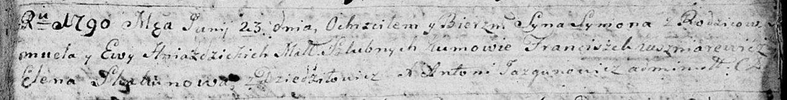
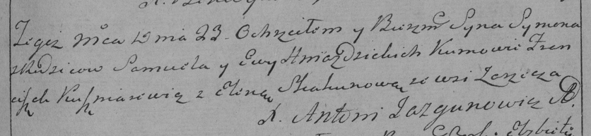

**Гнездицкий Сымон Самуилов (Hniazdzicki Symon)**

23 июня 1790 г -- крещение (НИАБ 136-13-894, лист 10, №34/1790-р
(ориг)), (РГИА 823-2-18, лист 240, №17/1790-р (коп)).

**НИАБ 136-13-894:** Лист 10. **Метрическая запись №34/1790-р (ориг).**

Дедиловичская Покровская церковь. 23 июня 1790 года. Метрическая запись
о крещении.

Hniazdzicki Symon -- сын родителей с деревни Дедиловичи.

Hniazdzicki Samuel -- отец.

Hniazdzicka Ewa -- мать.

Kuszniarewicz Franciszek - кум.

Skakunowa Elena - кума.

Jazgunowicz Antoni -- ксёндз.

**РГИА 823-2-18:** Лист 240. **Метрическая запись №17/1790-р (коп).**

Дедиловичская Покровская церковь. 23 июня 1790 года. Метрическая запись
о крещении.

Hniazdzicki Symon -- сын родителей с деревни Заречье.

Hniazdzicki Samuel -- отец.

Hniazdzicka Ewa -- мать.

Kuszniarewicz Franciszek -- кум.

Skakunowa Elena - кума.

Jazgunowicz Antoni -- ксёндз.
