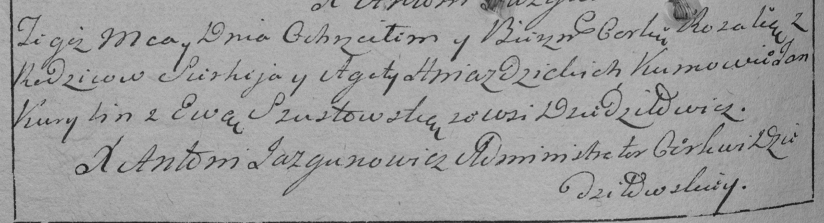

**Гнездицкая Розалия Сергеева (Hniazdzicka Rozalia)**

7 сентября 1791 г -- крещение (НИАБ 136-13-894, лист 14, №45/1791-р
(ориг)), (РГИА 823-2-18, лист 242, №24/1791-р (коп)).

**НИАБ 136-13-894:** Лист 14. **Метрическая запись №45/1791-р (ориг).**

{width="6.496527777777778in"
height="0.7395680227471566in"}

Дедиловичская Покровская церковь. 7 сентября 1791 года. Метрическая
запись о крещении.

Hniazdzicka Rozalia -- дочь родителей с деревни Дедиловичи.

Hniazdzicki Sarhey -- отец.

Hniazdzicka Agata -- мать.

Kurylin Janka - кум.

Susztowska Ewa - кума.

Jazgunowicz Antoni -- ксёндз.

**РГИА 823-2-18:** Лист 242об. **Метрическая запись №24/1791-р (коп).**

{width="6.496527777777778in"
height="1.7583333333333333in"}

Дедиловичская Покровская церковь. \[7\] сентября 1791 года. Метрическая
запись о крещении.

Hniazdzicka Rozalia -- дочь родителей с деревни Дедиловичи.

Hniazdzicki Sierhey -- отец.

Hniazdzicka Agata -- мать.

Kurylin Jan -- кум.

Szustowska Ewa - кума.

Jazgunowicz Antoni -- ксёндз.
