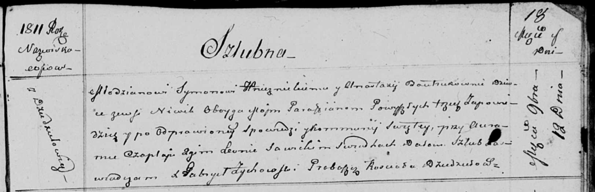

**Гнездицкий Сымон (Hniеznicki Symon)**

12 ноября 1811 г -- венчание с девкой Анастасией Бавтрук с деревни Нивки
(НИАБ 136-13-920, лист 18, №10/1811-б (ориг)).

**НИАБ 136-13-894:** Лист 18. **Метрическая запись №10/1811-б (ориг).**

Осовская Покровская церковь. 12 ноября 1811 года. Метрическая запись о
венчании.

Hnieznicki Symon -- жених, молодой, парафии Осовской, с деревни
Дедиловичи.

Bautrukowna Anastazya -- невеста, девка, парафии Осовской, с деревни
Нивки.

Czaplay Auram -- свидетель.

Sawicki Leon -- свидетель.

Zychowski Gabryel -- ксёндз костела Дедиловичского.
