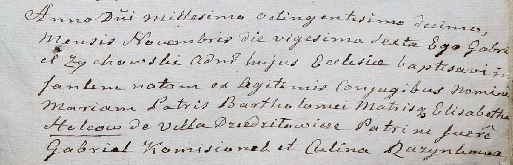

**Гольц Бартоломей (Helc, Holc Barthołomiei)**

6 декабря 1800 г -- крещение дочери Евы (НИАБ 937-4-32, лист 3,
№39/1800-р).

15 августа 1803 г -- крещение дочери Розалии (НИАБ 937-4-32, лист 9об,
№20/1803-р).

25 февраля 1805 г -- крещение дочери Марцеллы (НИАБ 937-4-32, лист 13,
№5/1806-р).

26 ноября 1810 г -- крещение дочери Марии (НИАБ 937-4-32, лист 22,
№19/1810-р).

**НИАБ 937-4-32:** Лист 3. **Метрическая запись №39/1800-р.**

Дедиловичский костел Наисвятейшего Сердца Иисуса. 6 декабря 1800 года.
Метрическая запись о крещении.

Helcowna Eva -- дочь вольных людей с деревни Дедиловичи.

Helc Barthołomiei -- отец.

Helcowa Elisabetha -- мать.

Komisionek Hauriłło -- крестный отец, с деревни Дедиловичи.

Rozynkowa Catharina -- крестная мать, с деревни Дедиловичи.

Linhart Hyacinthus -- ксёндз.

**НИАБ 937-4-32:** Лист 9об. **Метрическая запись №20/1803-р.**

Дедиловичский костел Наисвятейшего Сердца Иисуса. 15 августа 1803 года.
Метрическая запись о крещении.

Holcowna Rosalia -- дочь вольных людей с деревни Дедиловичи.

Holec Bathołomiey -- отец.

Holcowa Elisabetha -- мать.

Kamisionek Hauriła -- крестный отец, крестьянин.

Rosinkowa Culina -- крестная мать, крестьянка.

Galinowski Joann -- ксёндз, комендант Дедиловичского костела.

**НИАБ 937-4-32:** Лист 13. **Метрическая запись №5/1806-р.**

Дедиловичский костел Наисвятейшего Сердца Иисуса. 25 февраля 1806 года.
Метрическая запись о крещении.

Holcowna Marcella -- дочь родителей с деревни Дедиловичи.

Holec Bałtromiey -- отец.

Holcowa Elżbieta -- мать.

Komisionek Gabriel -- крестный отец.

Puzynczykowa Kulina -- крестная мать.

Rzucki Rafal -- ксёндз, комендант Дедиловичский.

**НИАБ 937-4-32:** Лист 22. **Метрическая запись №19/1810-р.**

Дедиловичский костел Наисвятейшего Сердца Иисуса. 26 ноября 1810 года.
Метрическая запись о крещении.

Holcowna Maria -- дочь родителей с деревни Дедиловичи.

Holc Barthołomiey -- отец.

Holcowa Elisabetha -- мать.

Komisionek Gabriel -- крестный отец.

Rozynkowa Culina -- крестная мать.

Zychowski Gabriel -- ксёндз.
