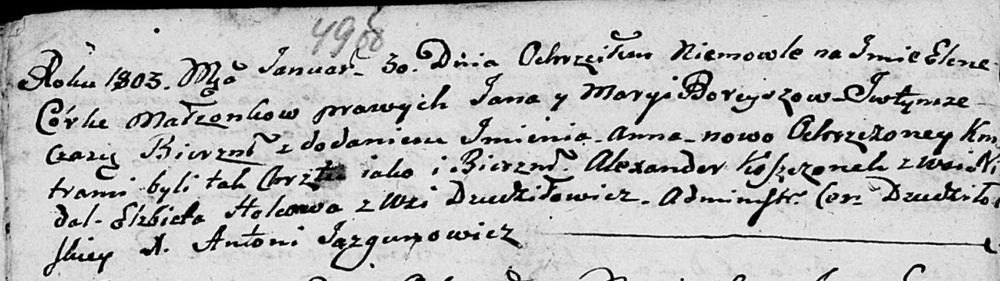

**Гольц Елисавета (Holzowa, Helcowa Elżbieta, Elisabetha)**

6 декабря 1800 г -- крещение дочери Евы (НИАБ 937-4-32, лист 3,
№39/1800-р).

2 марта 1802 г -- крестная мать Елены, дочери Яна и Катерины Скакунов с
деревни Дедиловичи (НИАБ 937-4-32, лист 6, №5/1802-р).

30 января 1803 г -- крестная мать у Елены Анны, дочери Борейш Яна и
Марыи (НИАБ 136-13-894, лист 49об, №3/1803-р (ориг)).

15 августа 1803 г -- крещение дочери Розалии (НИАБ 937-4-32, лист 9об,
№20/1803-р).

25 февраля 1805 г -- крещение дочери Марцеллы (НИАБ 937-4-32, лист 13,
№5/1806-р).

Декабрь 1809 г -- крестная мать Стефана, сына Яна и Катерины Скакунов с
деревни Дедиловичи (НИАБ 937-4-32, лист 20об, №33/1809-р).

26 ноября 1810 г -- крещение дочери Марии (НИАБ 937-4-32, лист 22,
№19/1810-р).

**НИАБ 937-4-32:** Лист 3. **Метрическая запись №39/1800-р.**

Дедиловичский костел Наисвятейшего Сердца Иисуса. 6 декабря 1800 года.
Метрическая запись о крещении.

{width="6.496527777777778in"
height="0.6458333333333334in"}

Helcowna Eva -- дочь вольных людей с деревни Дедиловичи.

Helc Barthołomiei -- отец.

Helcowa Elisabetha -- мать.

Komisionek Hauriłło -- крестный отец, с деревни Дедиловичи.

Rozynkowa Catharina -- крестная мать, с деревни Дедиловичи.

Linhart Hyacinthus -- ксёндз.

**НИАБ 937-4-32:** Лист 6. **Метрическая запись №5/1802-р.**

{width="6.496527777777778in"
height="0.8833333333333333in"}

Дедиловичский костел Наисвятейшего Сердца Иисуса. 2 марта 1802 года.
Метрическая запись о крещении.

Skakunowna Helena -- дочь крестьян с деревни Дедиловичи.

Skakun Joann -- отец.

Skakunowa Catharina -- мать.

Czaplay Abram -- крестный отец, крестьянин, с деревни Дедиловичи.

Holcowa Elisabetha -- крестная мать, с деревни Дедиловичи.

Linhart Hyacinthus -- ксёндз.

**НИАБ 136-13-894:** Лист 49об. **Метрическая запись №3/1803-р (ориг).**

{width="6.496527777777778in"
height="1.8284689413823272in"}

Дедиловичская Покровская церковь. 30 января 1803 года. Метрическая
запись о крещении.

Boreyszowna Elena Anna -- дочь.

Boreysza Jan -- отец.

Boreyszowa Maryia -- мать.

Koszczonek Alexander -- кум, с деревни Недаль.

Holcowa Elżbieta -- кума, с деревни Дедиловичи.

Jazgunowicz Antoni -- ксёндз.

**НИАБ 937-4-32:** Лист 9об. **Метрическая запись №20/1803-р.**

{width="6.496527777777778in"
height="0.6986111111111111in"}

Дедиловичский костел Наисвятейшего Сердца Иисуса. 15 августа 1803 года.
Метрическая запись о крещении.

Holcowna Rosalia -- дочь вольных людей с деревни Дедиловичи.

Holec Bathołomiey -- отец.

Holcowa Elisabetha -- мать.

Kamisionek Hauriła -- крестный отец, крестьянин.

Rosinkowa Culina -- крестная мать, крестьянка.

Galinowski Joann -- ксёндз, комендант Дедиловичского костела.

**НИАБ 937-4-32:** Лист 13. **Метрическая запись №5/1806-р.**

{width="6.496527777777778in"
height="1.1743055555555555in"}

Дедиловичский костел Наисвятейшего Сердца Иисуса. 25 февраля 1806 года.
Метрическая запись о крещении.

Holcowna Marcella -- дочь родителей с деревни Дедиловичи.

Holec Bałtromiey -- отец.

Holcowa Elżbieta -- мать.

Komisionek Gabriel -- крестный отец.

Puzynczykowa Kulina -- крестная мать.

Rzucki Rafal -- ксёндз, комендант Дедиловичский.

**НИАБ 937-4-32:** Лист 20об. **Метрическая запись №33/1809-р.**

{width="6.496527777777778in"
height="1.5368055555555555in"}

Дедиловичский костел Наисвятейшего Сердца Иисуса. Декабря 1809 года.
Метрическая запись о крещении.

Skakun Stephan -- сын крестьян с деревни Дедиловичи.

Skakun Joann -- отец.

Skakunowa Catharina -- мать.

Czaplay Auram -- крестный отец, с деревни Дедиловичи.

Holcowa Elisabetha -- крестная мать, с деревни Дедиловичи.

Miszkun Marcus -- ксёндз, комендант Дедиловичский.

**НИАБ 937-4-32:** Лист 22. **Метрическая запись №19/1810-р.**

{width="6.496527777777778in"
height="2.1013888888888888in"}

Дедиловичский костел Наисвятейшего Сердца Иисуса. 26 ноября 1810 года.
Метрическая запись о крещении.

Holcowna Maria -- дочь родителей с деревни Дедиловичи.

Holc Barthołomiey -- отец.

Holcowa Elisabetha -- мать.

Komisionek Gabriel -- крестный отец.

Rozynkowa Culina -- крестная мать.

Zychowski Gabriel -- ксёндз.
