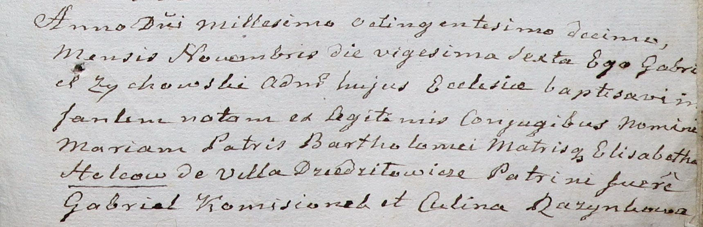

**Гольц Мария Бартоломеева (Holcowna Maria)**

26 ноября 1810 г -- крещение (НИАБ 937-4-32, лист 22, №19/1810-р).

**НИАБ 937-4-32:** Лист 22. **Метрическая запись №19/1810-р.**

Дедиловичский костел Наисвятейшего Сердца Иисуса. 26 ноября 1810 года.
Метрическая запись о крещении.

Holcowna Maria -- дочь родителей с деревни Дедиловичи.

Holc Barthołomiey -- отец.

Holcowa Elisabetha -- мать.

Komisionek Gabriel -- крестный отец.

Rozynkowa Culina -- крестная мать.

Zychowski Gabriel -- ксёндз.
