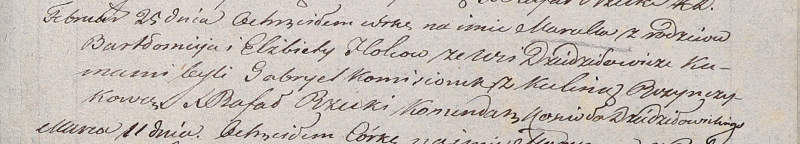

**Гольц Розалия Бартоломеева (Holzowna Rosalia)**

15 августа 1803 г -- крещение (НИАБ 937-4-32, лист 9об, №20/1803-р).

**НИАБ 136-13-894:** Лист 49об. **Метрическая запись №3/1803-р (ориг).**

{width="6.496527777777778in"
height="1.8284689413823272in"}

Дедиловичская Покровская церковь. 30 января 1803 года. Метрическая
запись о крещении.

Boreyszowna Elena Anna -- дочь.

Boreysza Jan -- отец.

Boreyszowa Maryia -- мать.

Koszczonek Alexander -- кум, с деревни Недаль.

Holcowa Elżbieta -- кума, с деревни Дедиловичи.

Jazgunowicz Antoni -- ксёндз.

**НИАБ 937-4-32:** Лист 9об. **Метрическая запись №20/1803-р.**

{width="6.496527777777778in"
height="0.6986111111111111in"}

Дедиловичский костел Наисвятейшего Сердца Иисуса. 15 августа 1803 года.
Метрическая запись о крещении.

Holcowna Rosalia -- дочь вольных людей с деревни Дедиловичи.

Holec Bathołomiey -- отец.

Holcowa Elisabetha -- мать.

Kamisionek Hauriła -- крестный отец, крестьянин.

Rosinkowa Culina -- крестная мать, крестьянка.

Galinowski Joann -- ксёндз, комендант Дедиловичского костела.
