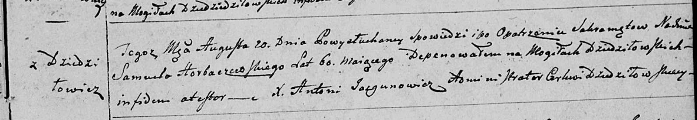
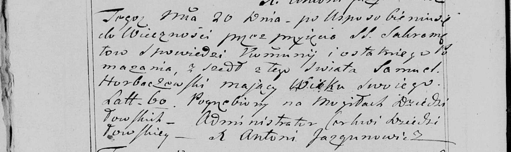

**Горбачёвский Самуэль (Horbaczowski Samuel)**

20 августа 1799 г -- отпевание, умер в возрасте 60 лет (родился около
1739 г) (НИАБ 136-13-919, лист 9, №13/1799-у (ориг), НИАБ 136-13-938,
лист 251об, №13/1799-у (коп)).

**НИАБ 136-13-919:** Лист 9. **Метрическая запись №13/1799-у (ориг).**

Дедиловичская Покровская церковь. 20 августа 1799 года. Метрическая
запись об отпевании.

Horbaczowski Samuel -- умерший, 60 лет, с деревни Дедиловичи, похоронен
на кладбище деревни Дедиловичи.

Jazgunowicz Antoni -- ксёндз.

**НИАБ 136-13-938:** Лист 251об. **Метрическая запись №13/1799-у
(коп).**

(См. тж. НИАБ 136-13-919, Лист 9. Метрическая запись №13/1799-у (ориг))

Дедиловичская Покровская церковь. 20 августа 1799 года. Метрическая
запись об отпевании.

Horbaczоwski Samuel -- умерший, 60 лет, с деревни \[Дедиловичи\],
похоронен на кладбище деревни Дедиловичи.

Jazgunowicz Antoni -- ксёндз.
