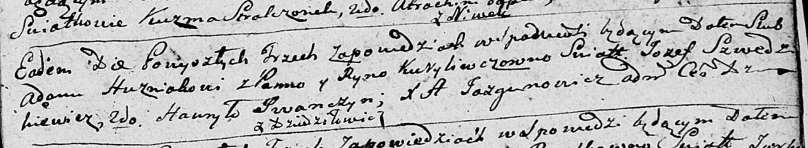
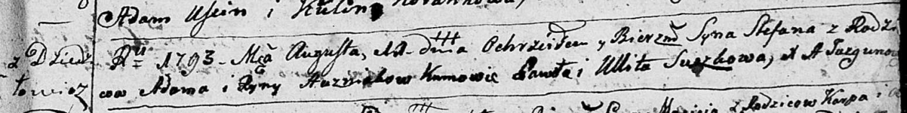
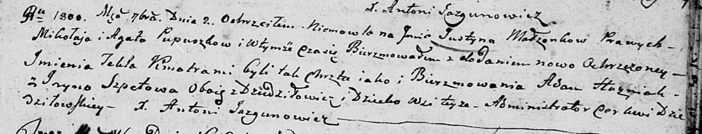
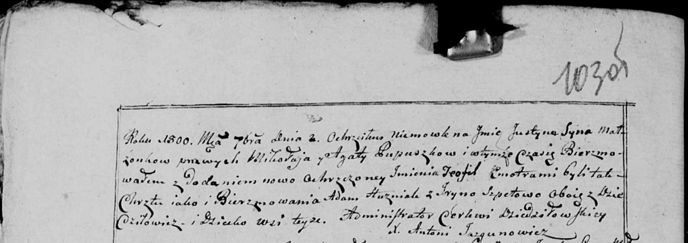
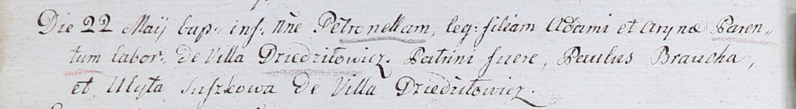
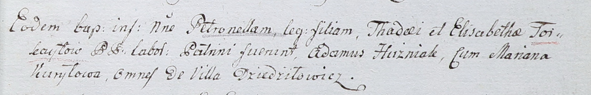

**Гузняк Адам (Huzniak Adam)**

10 ноября 1790 г -- венчание с Рыной Курилович (НИАБ 136-13-894, лист
69, №14/1790-б (ориг)).

11 августа 1793 г -- крещение сына Степана (НИАБ 136-13-894, лист 20,
№60/1793-р (ориг)), (РГИА 823-2-18, лист 248, №32/1793-р (коп)).

2 сентября 1800 г -- крестный отец Юстыны Текли, дочери Пупушков Миколая
и Агаты с деревни Дедиловичи (НИАБ 136-13-894, лист 42, №23/1800-р
(ориг), НИАБ 136-13-949, лист 103об, №26/1800-р (коп)).

22 мая 1802 г -- крещение дочери Петронели (НИАБ 937-4-32, лист 6об,
№11/1802-р).

24 августа 1802 г -- крестный отец Петронели, дочери Тадея и Елизабеты
Торкайлов с деревни Дедиловичи (НИАБ 937-4-32, лист 7, №25/1802-р).

**НИАБ 136-13-894:** Лист 69. **Метрическая запись №14/1790-б (ориг).**

Дедиловичская Покровская церковь. 10 ноября 1790 года. Метрическая
запись о венчании.

Huzniak Adam -- жених, с деревни Дедиловичи.

Kiryliwczowna Ryna -- невеста.

Szwedzkiewicz Jozef -- свидетель.

Jwanczyn Hauryło -- свидетель.

Jazgunowicz Antoni -- ксёндз.

**НИАБ 136-13-894:** Лист 20. **Метрическая запись №60/1793-р (ориг).**

Дедиловичская Покровская церковь. 11 августа 1793 года. Метрическая
запись о крещении.

Huzniak Stefan -- сын родителей с деревни Дедиловичи.

Huzniak Adam -- отец.

Huzniakowa Ryna -- мать.

Suszko Paweł - кум.

Suszkowa Ullita - кума.

Jazgunowicz Antoni -- ксёндз.

**РГИА 823-2-18:** Лист 248. **Метрическая запись №32/1793-р (коп).**

Дедиловичская Покровская церковь. 11 августа 1793 года. Метрическая
запись о крещении.

Huzniak Stefan -- сын родителей с деревни Дедиловичи.

Huzniak Adam -- отец.

Huzniakowa Aryna -- мать.

Suszko Paweł -- кум.

Suszkowa Ulita -- кума.

Jazgunowicz Antoni -- ксёндз.

**НИАБ 136-13-894:** Лист 42. **Метрическая запись №23/1800-р (ориг).**

Дедиловичская Покровская церковь. 2 сентября 1800 года. Метрическая
запись о крещении.

Pupuszkowna Justyna Tekla -- дочь родителей с деревни Дедиловичи.

Pupuszko Mikołay -- отец.

Pupuszkowa Agata -- мать.

Huzniak Adam -- кум, с деревни Дедиловичи.

Szpetowa Jryna -- кума, с деревни Дедиловичи.

Jazgunowicz Antoni -- ксёндз.

**НИАБ 836-13-949:** Лист 103об. **Метрическая запись №26/1800-р
(коп).**

(См. тж.: НИАБ 136-13-894, лист 42, №23/1800-р (ориг))

Дедиловичская Покровская церковь. 2 сентября 1800 года. Метрическая
запись о крещении.

Pupuszka Justyn Teofil \[Justyna Tekla\] -- сын \[дочь\] родителей с
деревни Дедиловичи.

Pupuszka Mikołay -- отец.

Pupuszkowa Agata -- мать.

Huzniak Adam -- кум, с деревни Дедиловичи.

Szpetowa Jryna - кума, с деревни Дедиловичи.

Jazgunowicz Antoni -- ксёндз.

**НИАБ 937-4-32:** Лист 6об. **Метрическая запись №11/1802-р.**

Дедиловичский костел Наисвятейшего Сердца Иисуса. 22 мая 1802 года.
Метрическая запись о крещении.

\[Huzniakowna\] Petronella -- дочь крестьян с деревни Дедиловичи.

\[Huzniak\] Adam -- отец.

\[Huzniakowa\] Aryna -- мать.

Broucha Paul -- крестный отец.

Suszkowa Ulyta -- крестная мать, с деревни Дедиловичи.

Linhart Hyacinthus -- ксёндз.

**НИАБ 937-4-32:** Лист 7. **Метрическая запись №25/1802-р.**

Дедиловичский костел Наисвятейшего Сердца Иисуса. 24 августа 1802 года.
Метрическая запись о крещении.

Torkayłowna Petronella -- дочь крестьян с деревни Дедиловичи.

Torkayło Thadey -- отец.

Torkayłowa Elisabetha -- мать.

Huzniak Adam -- крестный отец, с деревни Дедиловичи.

Kuryłowa Mariana -- крестная мать, с деревни Дедиловичи.

Linhart Hyacinthus -- ксёндз.
