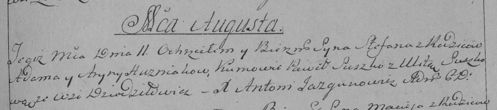

**Гузняк Петронеля Адамова (Huzniakowna Petronella)**

22 мая 1802 г -- крещение (НИАБ 937-4-32, лист 6об, №11/1802-р).

**НИАБ 937-4-32:** Лист 6об. **Метрическая запись №11/1802-р.**

{width="6.496527777777778in"
height="0.8923611111111112in"}

Дедиловичский костел Наисвятейшего Сердца Иисуса. 22 мая 1802 года.
Метрическая запись о крещении.

\[Huzniakowna\] Petronella -- дочь крестьян с деревни Дедиловичи.

\[Huzniak\] Adam -- отец.

\[Huzniakowa\] Aryna -- мать.

Broucha Paul -- крестный отец.

Suszkowa Ulyta -- крестная мать, с деревни Дедиловичи.

Linhart Hyacinthus -- ксёндз.
