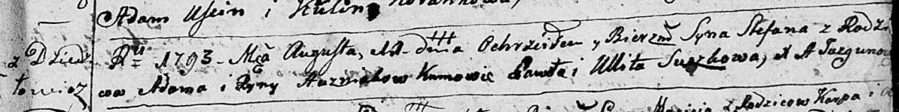
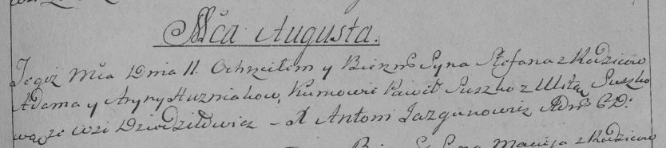

**Гузняк Степан Адамов (Huzniak Stefan)**

11 августа 1793 г -- крещение (НИАБ 136-13-894, лист 20, №60/1793-р
(ориг)), (РГИА 823-2-18, лист 248, №32/1793-р (коп)).

**НИАБ 136-13-894:** Лист 20. **Метрическая запись №60/1793-р (ориг).**

Дедиловичская Покровская церковь. 11 августа 1793 года. Метрическая
запись о крещении.

Huzniak Stefan -- сын родителей с деревни Дедиловичи.

Huzniak Adam -- отец.

Huzniakowa Ryna -- мать.

Suszko Paweł - кум.

Suszkowa Ullita - кума.

Jazgunowicz Antoni -- ксёндз.

**РГИА 823-2-18:** Лист 248. **Метрическая запись №32/1793-р (коп).**

Дедиловичская Покровская церковь. 11 августа 1793 года. Метрическая
запись о крещении.

Huzniak Stefan -- сын родителей с деревни Дедиловичи.

Huzniak Adam -- отец.

Huzniakowa Aryna -- мать.

Suszko Paweł -- кум.

Suszkowa Ulita -- кума.

Jazgunowicz Antoni -- ксёндз.
