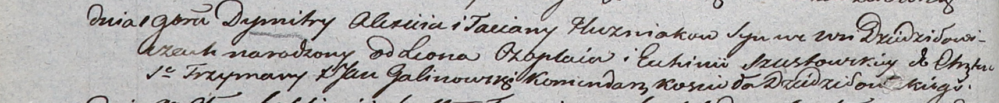

**Гузняк Алексей (Huzniak Alexij)**

1 ноября 1803 г -- крещение сына Дмитрия (НИАБ 937-4-32, лист 9об,
№27/1803-р).

**НИАБ 937-4-32:** Лист 9об. **Метрическая запись №27/1803-р.**

{width="6.496527777777778in"
height="0.6736111111111112in"}

Дедиловичский костел Наисвятейшего Сердца Иисуса. 1 ноября 1803 года.
Метрическая запись о крещении.

Huzniak Dymitry -- сын родителей с деревни Дедиловичи.

Huzniak Alexij -- отец.

Huzniakowa Taciana -- мать.

Czaplay Leon -- крестный отец.

Szustowska Euhinia -- крестная мать.

Galinowski Joann -- ксёндз, комендант Дедиловичского костела.
