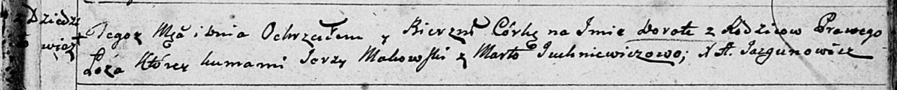
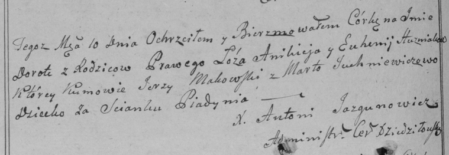

**Гузняк Евгения (Huzniakowa Euhenija)**

10 июля 1799 г -- крещение дочери Дороты (НИАБ 136-13-894, лист 39,
№28/1799-р (ориг)), (РГИА 823-2-18, лист 270об, №27/1799-р (коп)).

**НИАБ 136-13-894:** Лист 39. **Метрическая запись №28/1799-р (ориг).**

Дедиловичская Покровская церковь. 10 июля 1799 года. Метрическая запись
о крещении.

\[Huzniakowna\] Dorota -- дочь родителей с деревни Дедиловичи
\[Пядань\].

\[Huzniak Anikiey -- отец.\]

\[Huzniakowa Euhenija -- мать.\]

Makowski Jerzy -- кум.

Juchniewiczowa Marta -- кума.

Jazgunowicz Antoni -- ксёндз.

**РГИА 823-2-18:** Лист 270об. **Метрическая запись №27/1799-р (коп).**

Дедиловичская Покровская церковь. 10 июля 1799 года. Метрическая запись
о крещении.

Huzniakowna Dorota -- дочь родителей с застенка Пядань.

Huzniak Anikiey -- отец.

Huzniakowa Euhenija -- мать.

Makowski Jerzy -- кум.

Juchniewiczowa Marta -- кума.

Jazgunowicz Antoni -- ксёндз.
