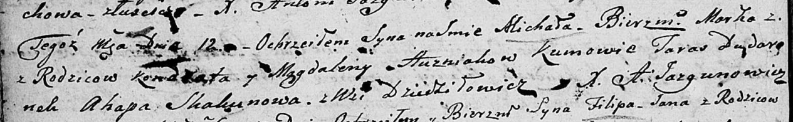

**Гузняк Магдалена (Huzniakowa Magdalena)**

12 ноября 1805 г -- крещение сына Михала Марка (НИАБ 136-13-894, лист
58, №52/1805-р (ориг)).

**НИАБ 136-13-894:** Лист 58. **Метрическая запись №52/1805-р (ориг).**

{width="6.496527777777778in"
height="1.006428258967629in"}

Дедиловичская Покровская церковь. 12 ноября 1805 года. Метрическая
запись о крещении.

Huzniak Michal Marko -- сын родителей с деревни Дедиловичи.

Huzniak Kondrat -- отец.

Huzniakowa Magdalena -- мать.

Dudaronek Taras -- кум.

Skakunowa Ahapa -- кума.

Jazgunowicz Antoni -- ксёндз.
