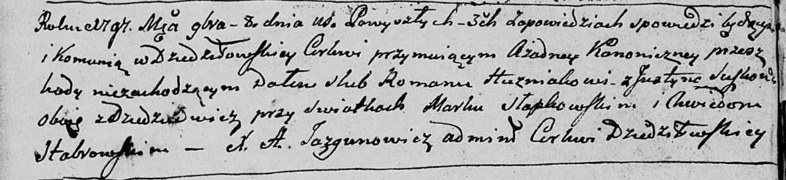
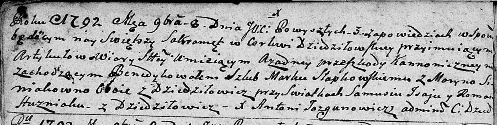

**Гузняк Роман (Huzniak Roman)**

8 ноября 1792 г -- свидетель венчания Марка Слабковского с деревни
Дедиловичи и Марыны Синяк с деревни Дедиловичи (НИАБ 136-13-894, лист
71об, №18/1792-б (ориг)).

8 ноября 1797 г -- венчание с Юстыной Сушко с деревни Дедиловичи (НИАБ
136-13-894, лист 71об, №18/1792-б (ориг)).

**НИАБ 136-13-920:** Лист 4об. **Метрическая запись №9/1797-б (ориг).**

Дедиловичская Покровская церковь. 8 ноября 1797 года. Метрическая запись
о венчании.

Huzniak Roman -- жених, с деревни Дедиловичи.

Suszkowa Justyna -- невеста, с деревни Дедиловичи.

Słabkowski Mark -- свидетель.

Stabrowski Chwiedor -- свидетель.

Jazgunowicz Antoni -- ксёндз.

**НИАБ 136-13-894:** Лист 71об. **Метрическая запись №18/1792-б
(ориг).**

Дедиловичская Покровская церковь. 8 ноября 1792 года. Метрическая запись
о венчании.

Słabkowski Marka -- жених, с деревни Дедиловичи.

Siniakowna Maryna -- невеста, с деревни Дедиловичи.

Jsaj Samuś -- свидетель.

Huzniak Roman -- свидетель, с деревни Дедиловичи.

Jazgunowicz Antoni -- ксёндз.
