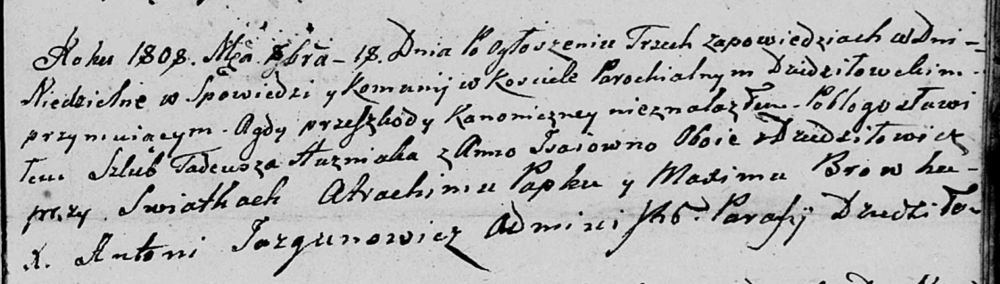

**Гузняк Тадей (Huzniak Tadeusz)**

18 октября 1808 г -- венчание с Анной Исай с деревни Дедиловичи (НИАБ
136-13-920, лист 14, №6/1808-б (ориг)).

**НИАБ 136-13-920:** Лист 14. **Метрическая запись №6/1808-б (ориг).**

Дедиловичская Покровская церковь. 18 октября 1808 года. Метрическая
запись о венчании.

Huzniak Tadeusz -- жених, с деревни Дедиловичи.

Jsaiowna Anna -- невеста, с деревни Дедиловичи.

Papko Atrachim -- свидетель.

Browka Maxim -- свидетель.

Jazgunowicz Antoni -- ксёндз.
