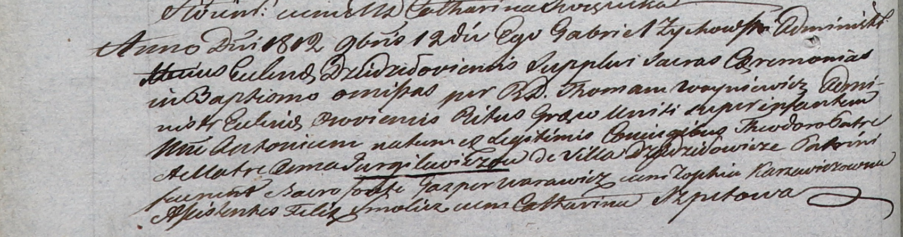

**Гургилевич Анна (Gurgilewiczowa Anna)**

12 ноября 1812 г -- крещение сына Антона (НИАБ 937-4-32, лист 25об,
№28/1812-р).

**НИАБ 937-4-32:** Лист 25об. **Метрическая запись №28/1812-р.**

Дедиловичский костел Наисвятейшего Сердца Иисуса. 12 ноября 1812 года.
Метрическая запись о крещении.

Gurgilewicz Antoni -- сын родителей с деревни Дедиловичи.

Gurgilewicz Theodor -- отец.

Gurgilewiczowa Anna -- мать.

Warawicz Gasper -- крестный отец.

Karzewiczowna Zophia -- крестная мать.

Smolicz Felix - ассистент.

Szpetowa Catharina - ассистентка.

Zychowski Gabriel -- ксёндз.

Woyniewicz Thomasz -- ксёндз, администратор Осовский.
