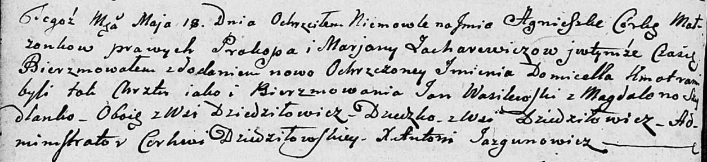

**Захаревич Агнешка Прокопова (Zacharewiczowna Agnieszka Domicella)**

18 мая 1802 года -- крещение (НИАБ 136-13-894, лист 46об, №16/1802-р
(ориг)).

**НИАБ 136-13-894:** Лист 46об. **Метрическая запись №16/1802-р
(ориг).**

Дедиловичская Покровская церковь. 18 мая 1802 года. Метрическая запись о
крещении.

Zacharewiczowna Agnieszka Domicella -- дочь родителей с деревни
Дедиловичи.

Zacharewicz Prokop -- отец.

Zacharewiczowa Marjana -- мать.

Wasilewski Jan -- кум, с деревни Дедиловичи.

Szydłanko Magdalena -- кума, с деревни Дедиловичи.

Jazgunowicz Antoni -- ксёндз.
