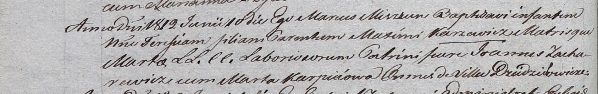

**Захаревич Ян (Zacharewicz Jan)**

20 февраля 1810 года -- венчание с Анной Сушко с деревни Дедиловичи
(НИАБ 136-13-920, лист 16об, №2/1810-р (ориг)).

10 июня 1812 г -- крестный отец Терезии, дочери Максыма и Марты
Каржевичей с деревни Дедиловичи (НИАБ 937-4-32, лист 24об, №13/1812-р).

**НИАБ 136-13-920:** Лист 16об. **Метрическая запись №2/1810-б (ориг).**

{width="6.496527777777778in"
height="1.841208442694663in"}

Дедиловичская Покровская церковь. 20 февраля 1810 года. Метрическая
запись о венчании.

Zacharewicz Jan -- жених, с деревни Дедиловичи.

Suszkowna Anna -- невеста, с деревни Дедиловичи.

Suszko Sawka -- свидетель, с деревни Дедиловичи.

Za\[cha\]rewicz Maysiey -- свидетель, с деревни Дедиловичи.

Jazgunowicz Antoni -- ксёндз.

**НИАБ 937-4-32:** Лист 24об. **Метрическая запись №13/1812-р.**

{width="6.496527777777778in"
height="1.0326388888888889in"}

Дедиловичский костел Наисвятейшего Сердца Иисуса. 10 июня 1812 года.
Метрическая запись о крещении.

Karzewiczowna Teresia -- дочь крестьян с деревни Дедиловичи.

Karzewicz Maxim -- отец.

Karzewiczowa Marta -- мать.

Zacharewicz Joann -- крестный отец, с деревни Дедиловичи.

Karpeiowa Marta -- крестная мать, с деревни Дедиловичи.

Miszkun Marcus -- ксёндз.
