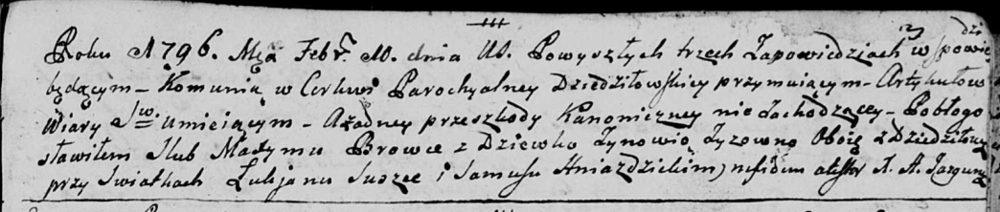

**Бровка (Зыз) Зыновия (Browkowa Zynowia z Zyzow)**

10 февраля 1796 г -- венчание с Максымом Бровкой с деревни Дедиловичи
(НИАБ 136-13-920, лист 3, №4/1796-б (ориг)).

**НИАБ 136-13-920:** Лист 3. **Метрическая запись №4/1796-б (ориг).**

Дедиловичская Покровская церковь. 10 февраля 1796 года. Метрическая
запись о венчании.

Browka Maxym -- жених, деревня Дедиловичи.

Zyzowna Zynowia -- невеста, девка, деревня Дедиловичи.

Suszko Łukjan -- свидетель.

Hniazdzicki Samuś -- свидетель.

Jazgunowicz Antoni -- ксёндз.
