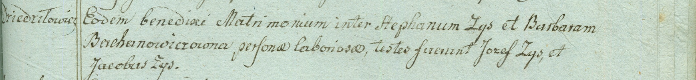

**Зыз Стефан (Zys Stephan)**

24 октября 1798 г -- венчание с крестьянкой Варварой Баханович (НИАБ
1781-27-199, лист 124, №2/1798-б).

**НИАБ 1781-27-199:** Лист 124. **Метрическая запись №2/1798-б.**

Дедиловичский костел Наисвятейшего Сердца Иисуса. 24 октября 1798 года.
Метрическая запись о венчании.

Zys Stephan -- жених, крестьянин, с деревни Дедиловичи.

Bachanowiczowna Barbara -- невеста, крестьянка.

Zys Josef -- свидетель.

Zys Jakob -- свидетель.

Linhart Hyacinthus -- ксёндз.
