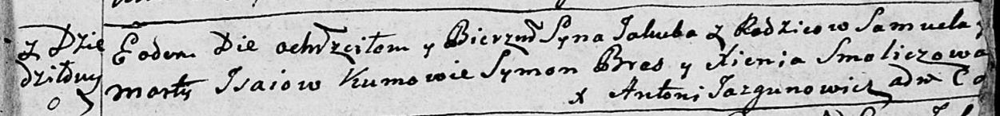

**Исай Самуил (Jsaj Samuel)**

18 августа 1787 года -- крещение дочери Анны (НИАБ 136-13-894, лист 2об,
№37/1787-р (ориг)), (НИАБ 136-13-894, лист 2об, №37/1787-р (ориг)).

30 сентября 1789 года -- крещение сына Фомы (НИАБ 136-13-894, лист 8,
№51/1789-р (ориг)).

17 октября 1792 года -- крещение сына Якуба (НИАБ 136-13-894, лист 17,
№65/1792-р (ориг)).

**НИАБ 136-13-894:** Лист 2об. **Метрическая запись №37/1787-р (ориг).**

Дедиловичская Покровская церковь. 18 августа 1787 года. Метрическая
запись о крещении.

Jsaiowna Anna - дочь родителей с деревни Дедиловичи.

Jsaj Samuel -- отец.

Jsaiowa Marta -- мать.

Szpet Jan - кум.

Smoliczowa Xienia - кума.

Jazgunowicz Antoniusz -- ксёндз.

**РГИА 823-2-18:** Лист 234об. **Метрическая запись №22/1787-р (коп).**

Дедиловичская Покровская церковь. 10 августа 1787 года. Метрическая
запись о крещении.

Jsaiowna Anna -- дочь родителей с деревни Дедиловичи.

Jsay Samuel -- отец.

Jsaiowa Marta -- мать.

Szpet Jan -- кум.

Smoliczowa Xienia - кума.

Jazgunowicz Antoni -- ксёндз.

**НИАБ 136-13-894:** Лист 8. **Метрическая запись №51/1789-р (ориг).**

Дедиловичская Покровская церковь. 30 сентября 1789 года. Метрическая
запись о крещении.

Jsaj Tomasz -- сын родителей с деревни Дедиловичи.

Jsaj Samuel -- отец.

Jsajowa Marta -- мать.

Symon - кум.

Smoliczowa Xienia - кума.

Jazgunowicz Antoni -- ксёндз.

**НИАБ 136-13-894:** Лист 17. **Метрическая запись №65/1792-р (ориг).**

Дедиловичская Покровская церковь. 17 октября 1792 года. Метрическая
запись о крещении.

Jsaj Jakub -- сын родителей с деревни Дедиловичи.

Jsaj Samuel -- отец.

Jsaiowa Marta -- мать.

Brez Symon - кум.

Smoliczowa Xienia - кума.

Jazgunowicz Antoni -- ксёндз.
