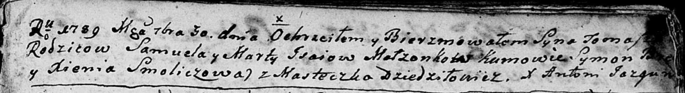

**Исай Фома Самуилов (Jsaj Tomasz)**

30 сентября 1789 года -- крещение (НИАБ 136-13-894, лист 8, №51/1789-р
(ориг)).

**НИАБ 136-13-894:** Лист 8. **Метрическая запись №51/1789-р (ориг).**

Дедиловичская Покровская церковь. 30 сентября 1789 года. Метрическая
запись о крещении.

Jsaj Tomasz -- сын родителей с деревни Дедиловичи.

Jsaj Samuel -- отец.

Jsajowa Marta -- мать.

Symon - кум.

Smoliczowa Xienia - кума.

Jazgunowicz Antoni -- ксёндз.
