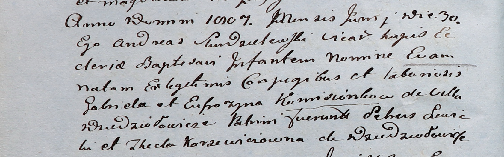
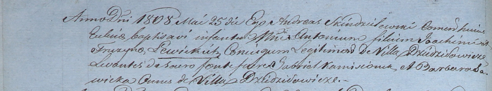

**Камизёнок Гаврыло (Komisionek Hauryło)**

3 мая 1800 г -- крещение сына Иосифа (НИАБ 937-4-32, лист 2,
№13/1800-р).

6 декабря 1800 г -- крестный отец Евы, дочери Бартоломея и Елисаветы
Гольцов с деревни Дедиловичи (НИАБ 937-4-32, лист 3, №39/1800-р).

17 ноября 1801 г -- крестный отец Станислава, сына Кастуся и Аксини с
деревни Недаль (НИАБ 937-4-32, лист 4об, №24/1801-р).

23 марта 1802 г -- крестный отец Марьяны, дочери Абрахама и Марьяны
Каржевичей с деревни Шилы (НИАБ 937-4-32, лист 6, №6/1802-р).

8 июня 1802 г -- крестный отец Антона, сына Мартина и Кулины Розынков с
деревни Дедиловичи (НИАБ 937-4-32, лист 6об, №13/1802-р).

4 июля 1802 г -- крещение дочери Павлины (НИАБ 937-4-32, лист 6об,
№19/1802-р).

5 марта 1803 г -- крестный отец Казимира, сына Якуба и Маруты Шпетов с
деревни Дедиловичи (НИАБ 937-4-32, лист 9, №6/1803-р).

1 января 1805 г -- крестный отец Базиля, сына Аврама и Марты Каржевичей
с деревни Дедиловичи (НИАБ 937-4-32, лист 11, №1/1805-р).

30 июня 1807 г -- крещение дочери Евы (НИАБ 937-4-32, лист 15об,
№11/1807-р).

25 мая 1808 г -- крестный отец Антона, сына Яхима и Фрузыны Левицких с
деревни Дедиловичи (НИАБ 937-4-32, лист 18об, №15/1808-р).

**НИАБ 937-4-32:** Лист 2. **Метрическая запись №13/1800-р.**

Дедиловичский костел Наисвятейшего Сердца Иисуса. 3 мая 1800 года.
Метрическая запись о крещении.

Komisionek Joseph -- сын крестьян с деревни Дедиловичи.

Komisionek Hauryło -- отец.

Komisionkowa Euphrosina -- мать.

Hniezdzicki Samuel -- крестный отец, с деревни Дедиловичи.

Szabłowska Theresia -- крестная мать, с деревни Дедиловичи.

Linhart Hyacinthus -- ксёндз.

**НИАБ 937-4-32:** Лист 3. **Метрическая запись №39/1800-р.**

Дедиловичский костел Наисвятейшего Сердца Иисуса. 6 декабря 1800 года.
Метрическая запись о крещении.

Helcowna Eva -- дочь вольных людей с деревни Дедиловичи.

Helc Barthołomiei -- отец.

Helcowa Elisabetha -- мать.

Komisionek Hauriłło -- крестный отец, с деревни Дедиловичи.

Rozynkowa Catharina -- крестная мать, с деревни Дедиловичи.

Linhart Hyacinthus -- ксёндз.

**НИАБ 937-4-32:** Лист 4об. **Метрическая запись №24/1801-р.**

Дедиловичский костел Наисвятейшего Сердца Иисуса. 17 ноября 1801 года.
Метрическая запись о крещении.

Stanisław -- сын родителей с деревни Недаль.

Castus -- отец.

Axinia -- мать.

Kamisionek Hariłło -- крестный отец, с деревни Дедиловичи.

Warawiczowa Marta -- крестная мать, с деревни Дедиловичи.

Linhart Hyacinthus -- ксёндз.

**НИАБ 937-4-32:** Лист 6. **Метрическая запись №6/1802-р.**

Дедиловичский костел Наисвятейшего Сердца Иисуса. 23 марта 1802 года.
Метрическая запись о крещении.

Karzewiczowna Mariana -- дочь крестьян с деревни Шилы.

Karzewicz Abraham -- отец.

Karzewiczowa Mariana -- мать.

Kamosionek Gabriel -- крестный отец, с деревни Дедиловичи?.

Popuszkowa Agatha -- крестная мать, с деревни Дедиловичи.

Linhart Hyacinthus -- ксёндз.

**НИАБ 937-4-32:** Лист 6об. **Метрическая запись №13/1802-р.**

Дедиловичский костел Наисвятейшего Сердца Иисуса. 8 июня 1802 года.
Метрическая запись о крещении.

Rozynko Antoni -- сын крестьян с деревни Дедиловичи.

Rozynko Martin -- отец.

Rozynkowa Kulina -- мать.

Komisionek Gabriel -- крестный отец, крестьянин, с деревни Дедиловичи.

Karpiejowa Martha -- крестная мать, крестьянка, с деревни Дедиловичи.

Linhart Hyacinthus -- ксёндз.

**НИАБ 937-4-32:** Лист 6об. **Метрическая запись №19/1802-р.**

Дедиловичский костел Наисвятейшего Сердца Иисуса. 4 июля 1802 года.
Метрическая запись о крещении.

Komisionkowna Paulina -- дочь крестьян с деревни Дедиловичи.

Kamisionek Hauryła -- отец.

Kamisionkowa Euphrosina -- мать.

Hnezdzicki Samuel -- крестный отец, крестьянин.

Słabkowska Theresia -- крестная мать, крестьянка, с деревни Дедиловичи.

Linhart Hyacinthus -- ксёндз.

**НИАБ 937-4-32:** Лист 9. **Метрическая запись №6/1803-р.**

Дедиловичский костел Наисвятейшего Сердца Иисуса. 5 марта 1803 года.
Метрическая запись о крещении.

Szpet Casimir -- сын вольных людей с деревни \[Дедиловичи\].

Szpet Jakob -- отец.

Szpetowa Mariana -- мать.

Kamisionek Hauryło -- крестный отец, с деревни Дедиловичи.

Matrusichwiczowa Zenowia -- крестная мать, с деревни Недаль.

Linhart Hyacinthus -- ксёндз.

**НИАБ 937-4-32:** Лист 11. **Метрическая запись №1/1805-р.**

Дедиловичский костел Наисвятейшего Сердца Иисуса. 1 января 1805 года.
Метрическая запись о крещении.

Karzewicz Basili -- сын крестьян с деревни Дедиловичи.

Karzewicz Abraham -- отец.

Karzewiczowa Marta -- мать.

Komisonek Hariłło -- крестный отец, с деревни Дедиловичи.

Popuszkowa Agatha -- крестная мать, с деревни Дедиловичи.

Linhart Hiacinthus -- ксёндз.

**НИАБ 937-4-32:** Лист 15об. **Метрическая запись №11/1807-р.**

Дедиловичский костел Наисвятейшего Сердца Иисуса. 30 июня 1807 года.
Метрическая запись о крещении.

Komisionkowna Eva -- дочь крестьян с деревни Дедиловичи.

Komisionek Gabriel -- отец.

Komisionkowa Eufrozyna -- мать.

Lewicki Sehus? -- крестный отец.

Karzewiczowna Thecla -- крестная мать, с деревни Дедиловичи.

Scindzelewski Andreas -- ксёндз, викарий Дедиловичский.

**НИАБ 937-4-32:** Лист 18об. **Метрическая запись №15/1808-р.**

Дедиловичский костел Наисвятейшего Сердца Иисуса. 25 мая 1808 года.
Метрическая запись о крещении.

Lewicki Antoni -- сын родителей с деревни Дедиловичи.

Lewiczki Joachim -- отец.

Lewiczka Fruzyna -- мать.

Kamisionek Gabriel -- крестный отец, с деревни Дедиловичи.

Sawicka Barbara -- крестная мать, с деревни Дедиловичи.

Scindzelewski Andreas -- ксёндз, комендант Дедиловичский.
