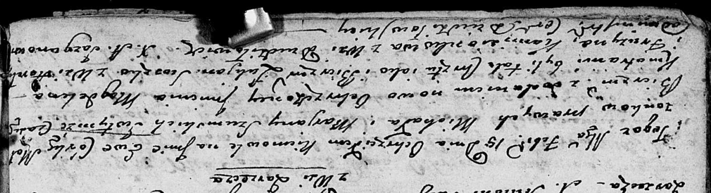

**Камизёнок Паулина Гаврилова (Komisionkowna Paulina)**

4 июля 1802 г -- крещение (НИАБ 937-4-32, лист 6об, №19/1802-р).

**НИАБ 937-4-32:** Лист 6об. **Метрическая запись №19/1802-р.**

{width="6.496527777777778in"
height="1.054861111111111in"}

Дедиловичский костел Наисвятейшего Сердца Иисуса. 4 июля 1802 года.
Метрическая запись о крещении.

Komisionkowna Paulina -- дочь крестьян с деревни Дедиловичи.

Kamisionek Hauryła -- отец.

Kamisionkowa Euphrosina -- мать.

Hnezdzicki Samuel -- крестный отец, крестьянин.

Słabkowska Theresia -- крестная мать, крестьянка, с деревни Дедиловичи.

Linhart Hyacinthus -- ксёндз.
