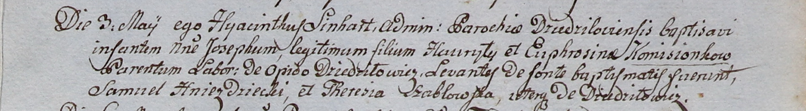
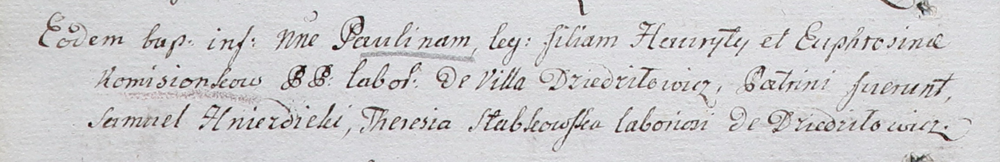
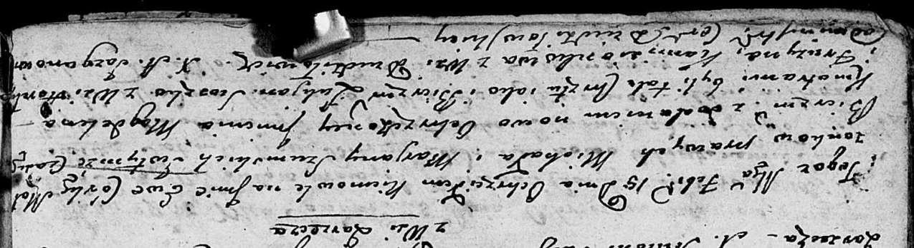
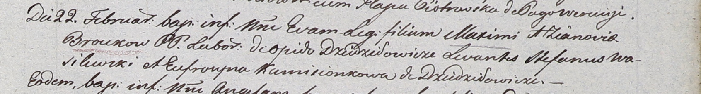
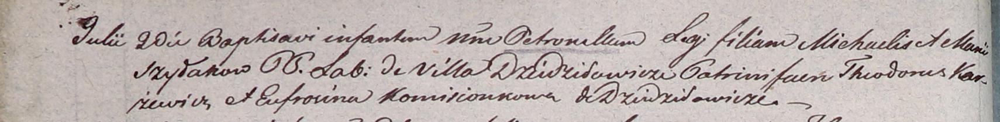
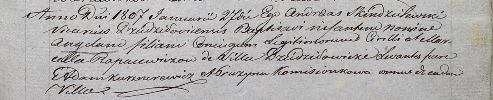
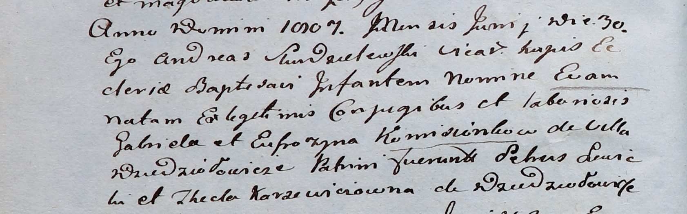
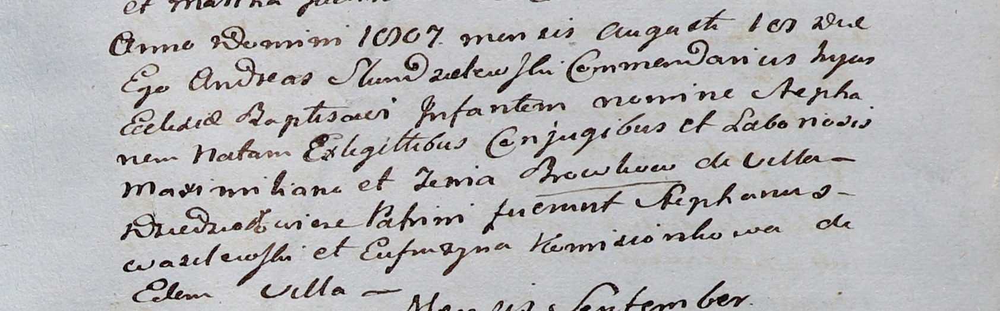
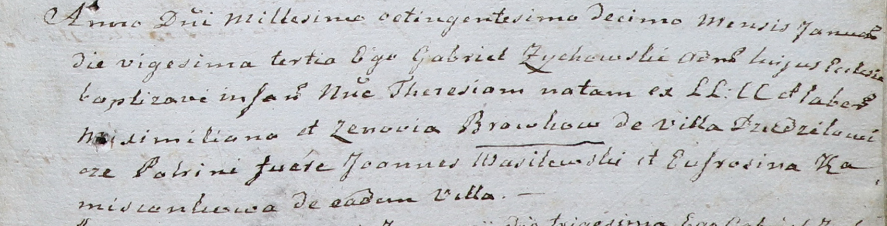

**Камизёнок Фрузына (Kamisionkowa Fruzyna, Eufrosina)**

3 мая 1800 г -- крещение сына Иосифа (НИАБ 937-4-32, лист 2,
№13/1800-р).

4 июля 1802 г -- крещение дочери Павлины (НИАБ 937-4-32, лист 6об,
№19/1802-р).

15 марта 1803 г -- крестная мать Евы Магдалены, дочери Шумских Михала и
Маруты с деревни Заречье (НИАБ 136-13-894, лист 49об, №9/1803-р (об)).

22 февраля 1803 г -- крестная мать Евы, дочери Максыма и Зыновии Бровков
с деревни Дедиловичи (НИАБ 937-4-32, лист 9, №3/1803-р).

20 июля 1804 г -- крестная мать Петронеля, дочери Михала и Марии Шилаков
с деревни Дедиловичи (НИАБ 937-4-32, лист 10об, №16/1804-р).

27 января 1807 г -- крестная мать Ангели, дочери Адама и Марцели
Рапацевичей с деревни Дедиловичи (НИАБ 937-4-32, лист 14, №2/1807-р).

30 июня 1807 г -- крещение дочери Евы (НИАБ 937-4-32, лист 15об,
№11/1807-р).

19 августа 1807 г -- крестная мать Стефана, сына Максыма и Зыновии
Бровков с деревни Дедиловичи (НИАБ 937-4-32, лист 16, №15/1807-р).

23 января 1810 г -- крестная мать Терезии, дочери Максыма и Зыновии
Бровков с деревни Дедиловичи (НИАБ 937-4-32, лист 21, №5/1810-р).

**НИАБ 937-4-32:** Лист 2. **Метрическая запись №13/1800-р.**

Дедиловичский костел Наисвятейшего Сердца Иисуса. 3 мая 1800 года.
Метрическая запись о крещении.

Komisionek Joseph -- сын крестьян с деревни Дедиловичи.

Komisionek Hauryło -- отец.

Komisionkowa Euphrosina -- мать.

Hniezdzicki Samuel -- крестный отец, с деревни Дедиловичи.

Szabłowska Theresia -- крестная мать, с деревни Дедиловичи.

Linhart Hyacinthus -- ксёндз.

**НИАБ 937-4-32:** Лист 6об. **Метрическая запись №19/1802-р.**

Дедиловичский костел Наисвятейшего Сердца Иисуса. 4 июля 1802 года.
Метрическая запись о крещении.

Komisionkowna Paulina -- дочь крестьян с деревни Дедиловичи.

Kamisionek Hauryła -- отец.

Kamisionkowa Euphrosina -- мать.

Hnezdzicki Samuel -- крестный отец, крестьянин.

Słabkowska Theresia -- крестная мать, крестьянка, с деревни Дедиловичи.

Linhart Hyacinthus -- ксёндз.

**НИАБ 136-13-894:** Лист 49об. **Метрическая запись №9/1803-р (ориг).**

Дедиловичская Покровская церковь. 15 февраля 1803 года. Метрическая
запись о крещении.

Szumska Ewa Magdalena -- дочь родителей с деревни Заречье.

Szumski Michał -- отец.

Szumska Marjana -- мать.

Suszko Łukjan -- кум, с деревни Горелое.

Kamisionkowa Fruzyna -- кума, с деревни Дедиловичи.

Jazgunowicz Antoni -- ксёндз.

**НИАБ 937-4-32:** Лист 9. **Метрическая запись №3/1803-р.**

Дедиловичский костел Наисвятейшего Сердца Иисуса. 22 февраля 1803 года.
Метрическая запись о крещении.

Broukowna Eva -- дочь крестьян с деревни Дедиловичи.

Brouka Maxim -- отец.

Broukowa Zianovia -- мать.

Wasilewski Stephan -- крестный отец.

Kamisionkowa Eufrosyna -- крестная мать, с деревни Дедиловичи.

Linhart Hyacinthus -- ксёндз.

**НИАБ 937-4-32:** Лист 10об. **Метрическая запись №16/1804-р.**

Дедиловичский костел Наисвятейшего Сердца Иисуса. 20 июля 1804 года.
Метрическая запись о крещении.

Szyłakowa Petronella -- дочь крестьян с деревни Дедиловичи.

Szyłak Michael -- отец.

Szyłakowa Maria -- мать.

Karzewicz Theodor -- крестный отец.

Kamisionkowa Eufrosina -- крестная мать, с деревни Дедиловичи.

Galinowski Joann -- ксёндз, комендант Дедиловичского костела.

**НИАБ 937-4-32:** Лист 14. **Метрическая запись №2/1807-р.**

Дедиловичский костел Наисвятейшего Сердца Иисуса. 27 января 1807 года.
Метрическая запись о крещении.

Rapacewiczowna Angela -- дочь родителей с деревни Дедиловичи.

Rapacewicz Cirilli -- отец.

Rapacewiczowa Marcella -- мать.

Kusznierewicz Adam -- крестный отец, с деревни Дедиловичи.

Komisionkowa Pruzyna -- крестная мать, с деревни Дедиловичи.

Skindzelewski Andreas -- ксёндз, викарий Дедиловичский.

**НИАБ 937-4-32:** Лист 15об. **Метрическая запись №11/1807-р.**

Дедиловичский костел Наисвятейшего Сердца Иисуса. 30 июня 1807 года.
Метрическая запись о крещении.

Komisionkowna Eva -- дочь крестьян с деревни Дедиловичи.

Komisionek Gabriel -- отец.

Komisionkowa Eufrozyna -- мать.

Lewicki Sehus? -- крестный отец.

Karzewiczowna Thecla -- крестная мать, с деревни Дедиловичи.

Scindzelewski Andreas -- ксёндз, викарий Дедиловичский.

**НИАБ 937-4-32:** Лист 16. **Метрическая запись №15/1807-р.**

Дедиловичский костел Наисвятейшего Сердца Иисуса. 19 августа 1807 года.
Метрическая запись о крещении.

Browka Stephan -- сын крестьян с деревни Дедиловичи.

Browka Maximilian -- отец.

Browkowa Zenia -- мать.

Wasilewski Stephan -- крестный отец.

Komisionkowa Eufrozyna -- крестная мать, с деревни Дедиловичи.

Scindzelewski Andreas -- ксёндз, викарий Дедиловичский.

**НИАБ 937-4-32:** Лист 21. **Метрическая запись №5/1810-р.**

Дедиловичский костел Наисвятейшего Сердца Иисуса. 23 января 1810 года.
Метрическая запись о крещении.

Browkowna Theresia -- дочь крестьян с деревни Дедиловичи.

Browka Maximilian -- отец.

Browkowa Zenovia -- мать.

Wasilewski Joann -- крестный отец.

Kamisionkowa Eufrosina -- крестная мать, с деревни Дедиловичи.

Zychowski Gabriel -- ксёндз.
