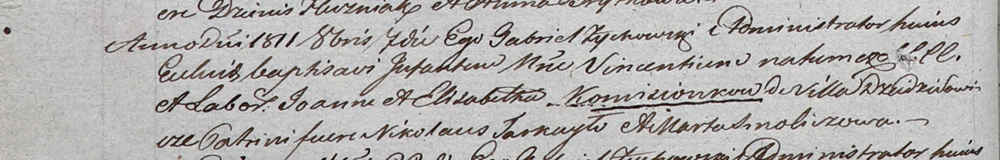

**Камизёнок Винцентий Иоаннов (Komisionek Vincenti)**

7 октября 1811 г -- крещение (НИАБ 937-4-32, лист 23об, №17/1811-р).

**НИАБ 937-4-32:** Лист 23об. **Метрическая запись №17/1811-р.**

Дедиловичский костел Наисвятейшего Сердца Иисуса. 7 октября 1811 года.
Метрическая запись о крещении.

Komisionek Vincenti -- сын крестьян с деревни Дедиловичи.

Komisionek Joann -- отец.

Komisionkowa Elisabetha -- мать.

Tarkayło Nikołaus -- крестный отец.

Smoliczowa Marta -- крестная мать.

Zychowski Gabriel -- ксёндз.
