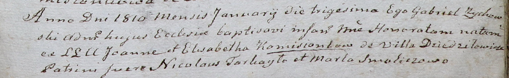

**Камизёнок Элизабета (Komisionkowa Elisabetha)**

30 января 1810 г -- крещение дочери Гонораты (НИАБ 937-4-32, лист 21,
№6/1810-р).

Апрель -- октябрь 1810 г -- крестная мать Марии, дочери Базыля и Варвары
Матрашил с деревни Нивки (НИАБ 937-4-32, лист 22, №14/1810-р).

7 октября 1811 г -- крещение сына Винцентия (НИАБ 937-4-32, лист 23об,
№17/1811-р).

**НИАБ 937-4-32:** Лист 21. **Метрическая запись №6/1810-р.**

Дедиловичский костел Наисвятейшего Сердца Иисуса. 30 января 1810 года.
Метрическая запись о крещении.

Komisionkowna Honorata -- дочь родителей с деревни Дедиловичи.

Komisionek Joann -- отец.

Komisionkowa Elisabetha -- мать.

Tarkayło Nicolay -- крестный отец.

Smoliczowa Marta -- крестная мать.

Zychowski Gabriel -- ксёндз.

**НИАБ 937-4-32:** Лист 22. **Метрическая запись №14/1810-р.**

Дедиловичский костел Наисвятейшего Сердца Иисуса. Апрель -- октябрь 1810
года. Метрическая запись о крещении.

Matrasewiczowna Maria -- дочь крестьян с деревни Нивки.

Matrasewicz Basilio -- отец.

Matrasewiczowa Barbara -- мать.

Szpet Stephan -- крестный отец.

Komisionkowa Elisobetha -- крестная мать, с деревни Дедиловичи.

Zychowski Gabriel -- ксёндз.

**НИАБ 937-4-32:** Лист 23об. **Метрическая запись №17/1811-р.**

Дедиловичский костел Наисвятейшего Сердца Иисуса. 7 октября 1811 года.
Метрическая запись о крещении.

Komisionek Vincentium -- сын крестьян с деревни Дедиловичи.

Komisionek Joann -- отец.

Komisionkowa Elisabetha -- мать.

Tarkayło Nikołaus -- крестный отец.

Smoliczowa Marta -- крестная мать.

Zychowski Gabriel -- ксёндз.
