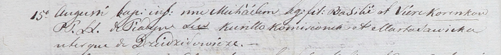

**Камизёнок Курыло (Komisionek Curiłło)**

15 августа 1801 г -- крестный отец Михала, сына Василя и Веры Кореньков
с деревни Пядань (НИАБ 937-4-32, лист 4об, №15/1800-р).

**НИАБ 937-4-32:** Лист 4об. **Метрическая запись №15/1801-р.**

{width="6.496527777777778in"
height="0.725in"}

Дедиловичский костел Наисвятейшего Сердца Иисуса. 15 августа 1801 года.
Метрическая запись о крещении.

Korenko Michael -- сын родителей с деревни Пядань.

Korenko Basili -- отец.

Korenkowa Viera -- мать.

Komisionek Curiłło -- крестный отец, с деревни Дедиловичи.

Sawicka Marta -- крестная мать, с деревни Дедиловичи.

Linhart Hyacinthus -- ксёндз.
