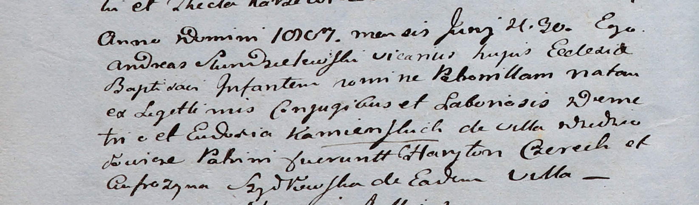

**Каминская Петронеля Дмитриева (Kamienska Petronilla)**

30 июня 1807 г -- крещение (НИАБ 937-4-32, лист 15об, №12/1807-р).

**НИАБ 937-4-32:** Лист 15об. **Метрическая запись №12/1807-р.**

Дедиловичский костел Наисвятейшего Сердца Иисуса. 30 июня 1807 года.
Метрическая запись о крещении.

Kamienska Petronilla -- дочь крестьян с деревни Дедиловичи.

Kamienski Demetri -- отец.

Kamienska Eudokia -- мать.

Czerech Charyton -- крестный отец.

Szydłowska Eufrozyna -- крестная мать, с деревни Дедиловичи.

Scindzelewski Andreas -- ксёндз, викарий Дедиловичский.
