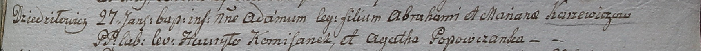

**Каржевич Адам Аврамов (Karżewicz Adam)**

27 января 1799 г -- крещение (НИАБ 1781-27-199, лист 125, №10/1799-р).

**НИАБ 1781-27-199:** Лист 125. **Метрическая запись №10/1799-р.**

{width="6.496527777777778in"
height="0.4847222222222222in"}

Дедиловичский костел Наисвятейшего Сердца Иисуса. 27 января 1799 года.
Метрическая запись о крещении.

Karzewicz Adam -- сын крестьян с деревни Дедиловичи.

Karzewicz Abraham -- отец.

Karzewiczowa Mariana -- мать.

Kamisanek Hauryło -- крестный отец.

Popowczanka Agatha - крестная мать.

Linhart Hyacinthus -- ксёндз.
