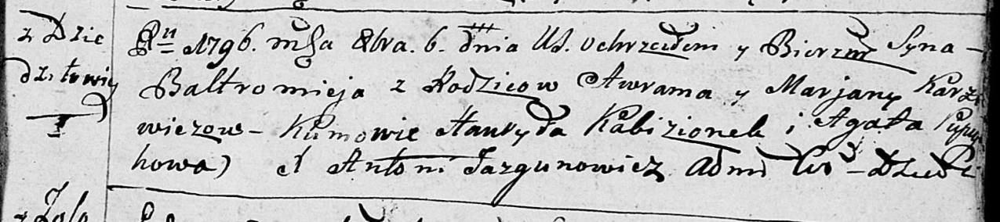
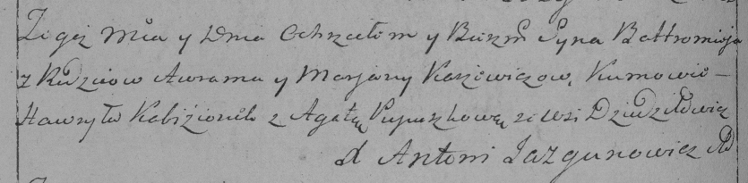

**Каржевич Балтромей Аврамов (Karżewicz Bałtromiey)**

6 октября 1796 г -- крещение (НИАБ 136-13-894, лист 31, №90/1796-р
(ориг)), (РГИА 823-2-18, лист 257об, №53/1796-р (коп)).

**НИАБ 136-13-894:** Лист 31. **Метрическая запись №90/1796-р (ориг).**

Дедиловичская Покровская церковь. 6 октября 1796 года. Метрическая
запись о крещении.

Karżewicz Bałtromey -- сын родителей с деревни Дедиловичи.

Karżewicz Awram -- отец.

Karżewicz Marjana -- мать.

Kabizionek Hawryła -- кум.

Pupuszkowa Agata - кума.

Jazgunowicz Antoni -- ксёндз.

**РГИА 823-2-18:** Лист 257об. **Метрическая запись №53/1796-р (коп).**

Дедиловичская Покровская церковь. \[6\] октября 1796 года. Метрическая
запись о крещении.

Karżewicz Bałtromiey -- сын родителей с деревни Дедиловичи.

Karżewicz Awram -- отец.

Karżewiczowa Marjana -- мать.

Kabizionek Hawryła -- кум.

Pupuszkowa Agata -- кума.

Jazgunowicz Antoni -- ксёндз.
