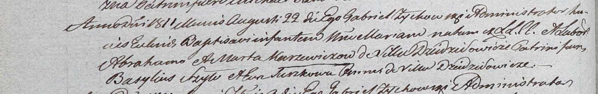

**Каржевич Мария Аврамова (Karżewiczowna Maria)**

22 августа 1811 г -- крещение (НИАБ 937-4-32, лист 23об, №14/1811-р).

**НИАБ 937-4-32:** Лист 23об. **Метрическая запись №14/1811-р.**

Дедиловичский костел Наисвятейшего Сердца Иисуса. 22 августа 1811 года.
Метрическая запись о крещении.

Karzewiczowna Maria -- дочь крестьян с деревни Дедиловичи.

Karzewicz Abraham -- отец.

Karzewiczowa Marta -- мать.

Szyło Basylius -- крестный отец, с деревни Дедиловичи.

Surzkowa Eva -- крестная мать, с деревни Дедиловичи.

Zychowski Gabriel -- ксёндз.
