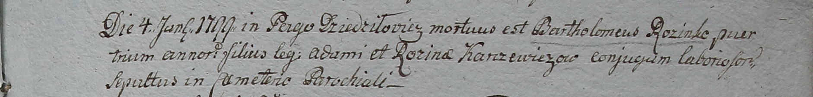

**Каржевич Бартоломей Адамов (Rozinko Adam)**

4 января 1799 г -- отпевание, умер в возрасте 4 лет (родился около 1795
г), с деревни Дедиловичи (НИАБ 1781-27-191, лист 127, №1/1799-у).

**НИАБ 1781-27-199:** Лист 127. **Метрическая запись №1/1799-у.**

Дедиловичский костел Наисвятейшего Сердца Иисуса. 4 января 1799 года.
Метрическая запись об отпевании.

\[Karczewicz\] Bartołomei -- умерший, 4 года, сын крестьян Adami et
Rozina \[z Rozinkow\] Karczewiczow с деревни Дедиловичи.

Linhart Hyacinthus -- ксёндз.
