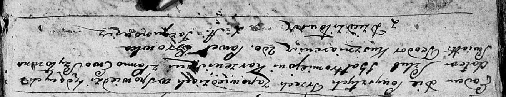

**Каржевич (Шило) Ева (Karżewiczowa Ewa z Szyłow)**

27 октября 1790 г -- венчание с Балтромеем Каржевичем с деревни
Дедиловичи (НИАБ 136-13-894, лист 68об, №10/1790-б (ориг)).

**НИАБ 136-13-894:** Лист 68об. **Метрическая запись №10/1790-б
(ориг).**

{width="6.496527777777778in"
height="1.2585389326334209in"}

Дедиловичская Покровская церковь. 27 октября 1790 года. Метрическая
запись о венчании.

Karżewicz Bałtromiey -- жених, с деревни Дедиловичи.

Szyłowna Ewa -- невеста.

Kuszniarewicz Teodor -- свидетель.

Browka Paweł -- свидетель.

Jazgunowicz Antoni -- ксёндз.
