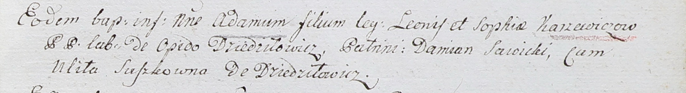

**Каржевич Адам Леонов (Karżewicz Adam)**

28 ноября 1802 г -- крещение (НИАБ 937-4-32, лист 8, №44/1802-р).

**НИАБ 937-4-32:** Лист 8. **Метрическая запись №44/1802-р.**

Дедиловичский костел Наисвятейшего Сердца Иисуса. 28 ноября 1802 года.
Метрическая запись о крещении.

Karzewicz Adam -- сын крестьян с деревни Дедиловичи.

Karzewicz Leon -- отец.

Karzewiczowa Sophia -- мать.

Sawicki Damian -- крестный отец.

Suszkowna Ulita -- крестная мать, с деревни Дедиловичи.

Linhart Hyacinthus -- ксёндз.
