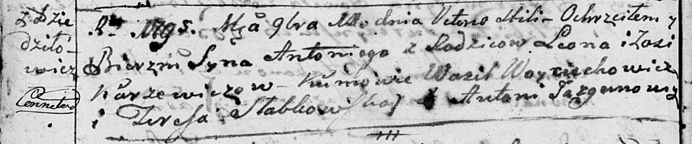
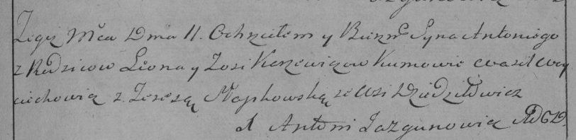

**Каржевич Антон Леонов (Karżewicz Antoni)**

11 ноября 1795 г -- крещение (НИАБ 136-13-894, лист 26об, №54/1795-р
(ориг)), (РГИА 823-2-18, лист 254, №40/1795-р (коп)).

**НИАБ 136-13-894:** Лист 26об. **Метрическая запись №54/1795-р
(ориг).**

Дедиловичская Покровская церковь. 11 ноября 1795 года. Метрическая
запись о крещении.

Karżewicz Antoni -- сын родителей с деревни Дедиловичи.

Karżewicz Leon -- отец.

Karżewiczowa Zosia -- мать.

Woyciechowicz Wasil - кум.

Słabkowska Teresa - кума.

Jazgunowicz Antoni -- ксёндз.

**РГИА 823-2-18:** Лист 254. **Метрическая запись №40/1795-р (коп).**

Дедиловичская Покровская церковь. 11 ноября 1795 года. Метрическая
запись о крещении.

Karżewicz Antoni -- сын родителей с деревни Дедиловичи.

Karżewicz Leon -- отец.

Karżewiczowa Zosia -- мать.

Woyciechowicz Wasil -- кум.

Słapkowska Teresa -- кума.

Jazgunowicz Antoni -- ксёндз.
