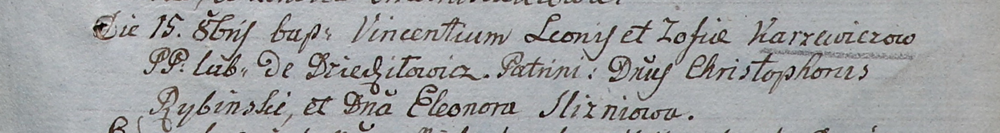

**Каржевич Винцентий Леонов младший (Karzewicz Vincenti)**

15 октября 1805 г -- крещение (НИАБ 937-4-32, лист 12, №36/1805-р).

**НИАБ 937-4-32:** Лист 12. **Метрическая запись №36/1805-р.**

Дедиловичский костел Наисвятейшего Сердца Иисуса. 15 октября 1805 года.
Метрическая запись о крещении.

Karzewicz Vincenti -- сын крестьян с деревни Дедиловичи.

Karzewicz Leon -- отец.

Karzewiczowa Zofia -- мать.

Rybinski Christophor -- крестный отец, шляхтич.

Slizniowa Eleonora -- крестная мать, шляхтянка.

Linhart Hiacinthus -- ксёндз.
