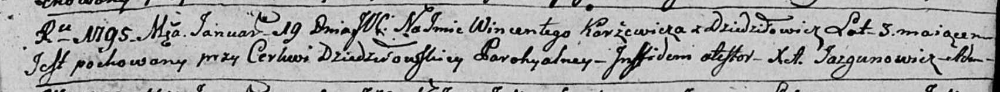

**Каржевич Винцентий Леонов (Karżewicz Wincenty)**

15 августа 1792 г -- крещение (НИАБ 136-13-894, лист 16об, №46/1792-р
(ориг)), (РГИА 823-2-18, лист 244об, №21/1792-р (коп)).

19 января 1795 г -- отпевание, умер в возрасте 3 лет (НИАБ 136-13-919,
лист 4, №4/1795-у (ориг)).

**НИАБ 136-13-894:** Лист 16об. **Метрическая запись №46/1792-р
(ориг).**

{width="6.496527777777778in"
height="0.876350612423447in"}

Дедиловичская Покровская церковь. 15 августа 1792 года. Метрическая
запись о крещении.

Karżewicz Wincenty -- сын родителей с деревни Дедиловичи.

Karżewicz Leon -- отец.

Karżewiczowa Zosia -- мать.

Jsay Samuel - кум.

Słapkowska Teresia - кума.

Jazgunowicz Antoni -- ксёндз.

**РГИА 823-2-18:** Лист 244об. **Метрическая запись №21/1792-р (коп).**

(См. тж.: НИАБ 136-13-894, лист 16об, №46/1792-р (ориг))

{width="6.496527777777778in"
height="1.8652777777777778in"}

Дедиловичская Покровская церковь. 15 августа 1792 года. Метрическая
запись о крещении.

Karżewicz Wincenty -- сын родителей с деревни Дедиловичи.

Karżewicz Leon -- отец.

Karżewiczowa Zosia -- мать.

Jsay Samuel -- кум.

Słabkowska Teresa -- кума.

Jazgunowicz Antoni -- ксёндз.

**НИАБ 136-13-919:** Лист 4. **Метрическая запись №4/1795-у (ориг).**

{width="6.496527777777778in"
height="0.5986111111111111in"}

Дедиловичская Покровская церковь. 19 января 1795 года. Метрическая
запись об отпевании.

Karżewicz Wincenty -- умерший, 3 года, с деревни Дедиловичи, похоронен
на кладбище при церкви Дедиловичской.

Jazgunowicz Antoni -- ксёндз.
