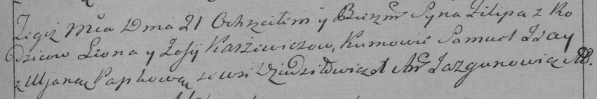

**Каржевич Филипп Леонов (Karżewicz Filip)**

21 ноября 1789 г -- крещение (НИАБ 136-13-894, лист 8, №61/1789-р
(ориг)), (РГИА 823-2-18, лист 239, №29/1789-р (коп)).

**НИАБ 136-13-894:** Лист 8. **Метрическая запись №61/1789-р (ориг).**

{width="6.496527777777778in"
height="0.889760498687664in"}

Дедиловичская Покровская церковь. 21 ноября 1789 года. Метрическая
запись о крещении.

Karżewicz Filip -- сын родителей с деревни Дедиловичи.

Karżewicz Leon -- отец.

Karżewiczowa Zofija -- мать.

Jsaj Samuel - кум.

Papkowa Ullana - кума.

Jazgunowicz Antoni -- ксёндз.

Лист 239. **Метрическая запись №29/1789-р (коп).**

{width="6.496527777777778in"
height="1.0840277777777778in"}

Дедиловичская Покровская церковь. 21 ноября 1789 года. Метрическая
запись о крещении.

Karżewicz Filip -- сын родителей с деревни Дедиловичи.

Karżewicz Leon -- отец.

Karżewiczowa Zofija -- мать.

Jsay Samuel -- кум.

Papkowa Uljana - кума.

Jazgunowicz Antoni -- ксёндз.
