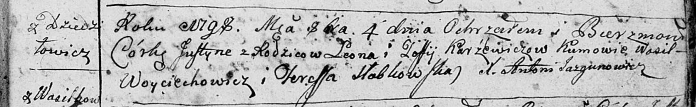
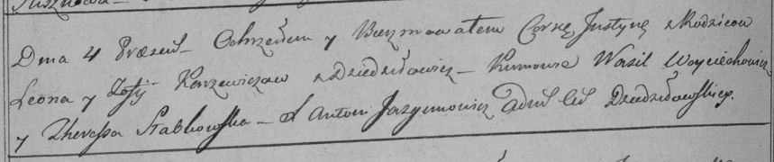
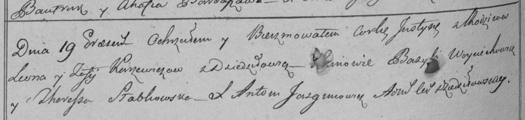

**Каржевич Юстына Леонова (Karżewiczowna Justyna)**

4 октября 1798 г -- крещение (НИАБ 136-13-894, лист 37, №50/1798-р
(ориг)), (РГИА 823-2-18, лист 266об, №51/1798-р (коп)), (РГИА 823-2-18,
лист 266об, №56/1798-р (коп)).

**НИАБ 136-13-894:** Лист 37. **Метрическая запись №50/1798-р (ориг).**

Дедиловичская Покровская церковь. 4 октября 1798 года. Метрическая
запись о крещении.

Karżewiczowna Justyna -- дочь родителей с деревни Дедиловичи.

Karżewicz Leon -- отец.

Karżewiczowa Zofija -- мать.

Woyciechowicz Wasil - кум.

Słabkowska Teresa - кума.

Jazgunowicz Antoni -- ксёндз.

**РГИА 823-2-18:** Лист 266об. **Метрическая запись №51/1798-р (коп).**

Дедиловичская Покровская церковь. 4 октября 1798 года. Метрическая
запись о крещении.

Karżewiczowna Justyna -- дочь родителей с деревни Дедиловичи.

Karżewicz Leon -- отец.

Karżewiczowa Zofija -- мать.

Woyciechowicz Wasil -- кум.

Słabkowska Theresia -- кума.

Jazgunowicz Antoni -- ксёндз.

**РГИА 823-2-18:** Лист 266об. **Метрическая запись №56/1798-р (коп).**

Дедиловичская Покровская церковь. 19 \[сентября\] 1798 года. Метрическая
запись о крещении.

Karżewiczowna Justyna -- дочь родителей с деревни Дедиловичи.

Karżewicz Leon -- отец.

Karżewiczowa Zofija -- мать.

Woyciechowicz Bazyli -- кум.

Słabkowska Theresia -- кума.

Jazgunowicz Antoni -- ксёндз.
