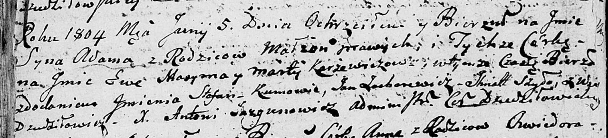

**Каржевич Адам Максымов (Karżewicz Adam Stefan)**

5 июня 1804 г -- крещение (НИАБ 136-13-894, лист 53об, №14/1804-р
(ориг)).

**НИАБ 136-13-894:** Лист 53об. **Метрическая запись №14/1804-р
(ориг).**

Дедиловичская Покровская церковь. 5 июня 1804 года. Метрическая запись о
крещении.

Karżewicz Adam Stefan -- сын родителей с деревни Дедиловичи.

Karżewicz Maxym -- отец.

Karżewiczowa Marta -- мать.

Zubarewicz Jan -- кум.

Szyło Jhnat -- кума.

Jazgunowicz Antoni -- ксёндз.
