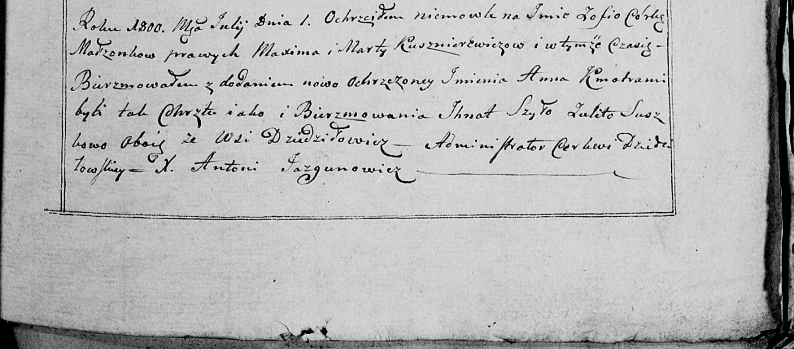

**Каржевич Зофия Максымова (Karżewiczowna Zofia Anna)**

1 июля 1800 г -- крещение (НИАБ 136-13-894, лист 41об, №15/1800-р
(ориг), РГИА 823-2-18, лист 276, №14/1800-р (коп), НИАБ 136-13-949, лист
102, №16/1800-р (коп)).

**НИАБ 136-13-894:** Лист 41об. **Метрическая запись №15/1800-р
(ориг).**

{width="6.496527777777778in"
height="1.5937915573053367in"}

Дедиловичская Покровская церковь. 1 июля 1800 года. Метрическая запись о
крещении.

Karżewiczowna Zofia Anna -- дочь родителей с деревни Дедиловичи.

Karżewicz Maxym -- отец.

Karżewiczowa Marta -- мать.

Szyło Jhnat -- кум, с деревни Озерщизна.

Suszkowa Ullita -- кума, с деревни Дедиловичи.

Jazgunowicz Antoni -- ксёндз.

**РГИА 823-2-18:** Лист 276. **Метрическая запись №14/1800-р (коп).**

{width="6.496527777777778in"
height="2.691666666666667in"}

Дедиловичская Покровская церковь. 1 июля 1800 года. Метрическая запись о
крещении.

Karżewiczowna Zofia Anna -- дочь родителей с деревни \[Дедиловичи\].

Karżewicz Maxim -- отец.

Karżewiczowa Marta -- мать.

Szyło Jhnat -- кум, с деревни Озерщизна.

Suszkowa Ullita -- кума, с деревни Дедиловичи.

Jazgunowicz Antoni -- ксёндз.

**НИАБ 136-13-949:** Лист 102. **Метрическая запись №16/1800-р (коп).**

(См. тж.: РГИА 823-2-18, лист 276, №14/1800-р (коп), НИАБ 136-13-894,
лист 41j,, №15/1800-р (ориг))

{width="6.496527777777778in"
height="2.8555555555555556in"}

Дедиловичская Покровская церковь. 1 июля 1800 года. Метрическая запись о
крещении.

Kuszniarewiczowna \[Karżewiczowna\] Zofia Anna -- дочь родителей с
деревни \[Дедиловичи\].

Kuszniarewicz \[Karżewicz\] Maxim -- отец.

Kuszniarewiczowa \[Karżewiczowa\] Marta -- мать.

Szyło Jhnat -- кум, с деревни Дедиловичи \[Озерщизна\].

Suszkowa Ulita - кума, с деревни Дедиловичи.

Jazgunowicz Antoni -- ксёндз.
