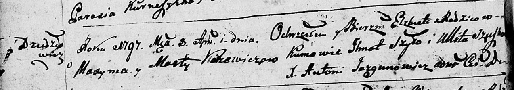

**Каржевич Максым (Karżewicz Maxym)**

24 октября 1792 г -- венчание с Мартой Скакун с деревни Дедиловичи (НИАБ
136-13-894, лист 71, №11/1792-б (ориг)).

5 февраля 1794 г -- крещение дочери Викторыи (НИАБ 136-13-894, лист
21об, №8/1794-р (ориг)).

8 апреля 1797 г -- крещение дочери Елисаветы (НИАБ 136-13-894, лист
32об, №20/1797-р (ориг)).

1 июля 1800 г -- крещение дочери Зофьи Анны (НИАБ 136-13-894, лист 41об,
№15/1800-р (ориг), РГИА 823-2-18, лист 276, №14/1800-р (коп), НИАБ
136-13-949, лист 102, №16/1800-р (коп)).

5 июня 1804 г -- крещение сына Адама Стефана (НИАБ 136-13-894, лист
53об, №14/1804-р (ориг)).

23 августа 1808 г -- крещение дочери Насты (НИАБ 136-13-894, лист 72об,
№35/1808-р (ориг)).

10 июня 1812 г -- крещение дочери Терезии (НИАБ 937-4-32, лист 24об,
№13/1812-р).

**НИАБ 136-13-894:** Лист 71. **Метрическая запись №11/1792-б (ориг).**

{width="6.496527777777778in"
height="1.5133311461067367in"}

Дедиловичская Покровская церковь. 24 октября 1792 года. Метрическая
запись о венчании.

Karżewicz Maxym -- жених, с деревни Дедиловичи.

Skakunowna Marta -- невеста, с деревни Дедиловичи.

Kasucki Dziamid -- свидетель.

Skakun Wasil -- свидетель.

Jazgunowicz Antoni -- ксёндз.

**НИАБ 136-13-894:** Лист 21-об. **Метрическая запись №8/1794-р
(ориг).**

{width="6.496527777777778in"
height="1.1780785214348206in"}

Дедиловичская Покровская церковь. 5 февраля 1794 года. Метрическая
запись о крещении.

Karżewiczowna Wiktoryia -- дочь родителей с деревни Дедиловичи.

Karżewicz Maxym -- отец.

Karżewiczowa Marta -- мать.

Szyło Jhnat - кум.

Szuszkowa Ullita - кума.

Ziekrocki Kondrat -- ассистент.

Zarochsianka Marysia -- ассистентка.

Jazgunowicz Antoni -- ксёндз.

**НИАБ 136-13-894:** Лист 32об. **Метрическая запись №20/1797-р
(ориг).**

{width="6.496527777777778in"
height="1.1378477690288713in"}

Дедиловичская Покровская церковь. 8 апреля 1797 года. Метрическая запись
о крещении.

Karżewiczowna Elżbieta -- дочь родителей с деревни Дедиловичи.

Karżewicz Maxim -- отец.

Karżewiczowa Marta -- мать.

Szyło Jhnat - кум.

Szuszko Ullita - кума.

Jazgunowicz Antoni -- ксёндз.

**НИАБ 136-13-894:** Лист 41-об. **Метрическая запись №15/1800-р
(ориг).**

{width="6.496527777777778in"
height="1.5937915573053367in"}

Дедиловичская Покровская церковь. 1 июля 1800 года. Метрическая запись о
крещении.

Karżewiczowna Zofia Anna -- дочь родителей с деревни Дедиловичи.

Karżewicz Maxym -- отец.

Karżewiczowa Marta -- мать.

Szyło Jhnat -- кум, с деревни Озерщизна.

Suszkowa Ullita -- кума, с деревни Дедиловичи.

Jazgunowicz Antoni -- ксёндз.

**НИАБ 136-13-949:** Лист 102. **Метрическая запись №16/1800-р (коп).**

(См. тж.: РГИА 823-2-18, лист 276, №14/1800-р (коп), НИАБ 136-13-894,
лист 41j,, №15/1800-р (ориг))

{width="6.496527777777778in"
height="2.8555555555555556in"}

Дедиловичская Покровская церковь. 1 июля 1800 года. Метрическая запись о
крещении.

Kuszniarewiczowna \[Karżewiczowna\] Zofia Anna -- дочь родителей с
деревни \[Дедиловичи\].

Kuszniarewicz \[Karżewicz\] Maxim -- отец.

Kuszniarewiczowa \[Karżewiczowa\] Marta -- мать.

Szyło Jhnat -- кум, с деревни Дедиловичи \[Озерщизна\].

Suszkowa Ulita - кума, с деревни Дедиловичи.

Jazgunowicz Antoni -- ксёндз.

**РГИА 823-2-18:** Лист 276. **Метрическая запись №14/1800-р (коп).**

{width="6.496527777777778in"
height="2.691666666666667in"}

Дедиловичская Покровская церковь. 1 июля 1800 года. Метрическая запись о
крещении.

Karżewiczowna Zofia Anna -- дочь родителей с деревни \[Дедиловичи\].

Karżewicz Maxim -- отец.

Karżewiczowa Marta -- мать.

Szyło Jhnat -- кум, с деревни Озерщизна.

Suszkowa Ullita -- кума, с деревни Дедиловичи.

Jazgunowicz Antoni -- ксёндз.

**НИАБ 136-13-894:** Лист 53об. **Метрическая запись №14/1804-р
(ориг).**

{width="6.496527777777778in"
height="1.4831583552055994in"}

Дедиловичская Покровская церковь. 5 июня 1804 года. Метрическая запись о
крещении.

Karżewicz Adam Stefan -- сын родителей с деревни Дедиловичи.

Karżewicz Maxym -- отец.

Karżewiczowa Marta -- мать.

Zubarewicz Jan -- кум.

Szyło Jhnat -- кума.

Jazgunowicz Antoni -- ксёндз.

**НИАБ 136-13-894:** Лист 72об. **Метрическая запись №35/1808-р
(ориг).**

{width="6.496527777777778in"
height="1.6936964129483814in"}

Дедиловичская Покровская церковь. 23 августа 1808 года. Метрическая
запись о крещении.

Karżewiczowna Nasta -- дочь родителей с деревни Дедиловичи.

Karżewicz Maxim -- отец.

Karżewiczowa Marta -- мать.

Pupuszka Jozef -- кум.

Suszkowa Marta -- кума.

Jazgunowicz Antoni -- ксёндз.

**НИАБ 937-4-32:** Лист 24об. **Метрическая запись №13/1812-р.**

{width="6.496527777777778in"
height="1.0326388888888889in"}

Дедиловичский костел Наисвятейшего Сердца Иисуса. 10 июня 1812 года.
Метрическая запись о крещении.

Karzewiczowna Teresia -- дочь крестьян с деревни Дедиловичи.

Karzewicz Maxim -- отец.

Karzewiczowa Marta -- мать.

Zacharewicz Joann -- крестный отец, с деревни Дедиловичи.

Karpeiowa Marta -- крестная мать, с деревни Дедиловичи.

Miszkun Marcus -- ксёндз.
