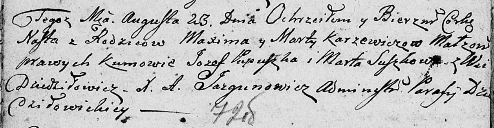

**Каржевич Наста Максымова (Karżewiczowna Nasta)**

23 августа 1808 г -- крещение дочери Насты (НИАБ 136-13-894, лист 72об,
№35/1808-р (ориг)).

**НИАБ 136-13-894:** Лист 72об. **Метрическая запись №35/1808-р
(ориг).**

Дедиловичская Покровская церковь. 23 августа 1808 года. Метрическая
запись о крещении.

Karżewiczowna Nasta -- дочь родителей с деревни Дедиловичи.

Karżewicz Maxim -- отец.

Karżewiczowa Marta -- мать.

Pupuszka Jozef -- кум.

Suszkowa Marta -- кума.

Jazgunowicz Antoni -- ксёндз.
