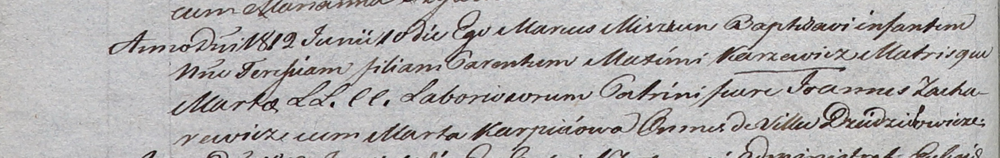

**Каржевич Терезия Максымова (Karżewiczowna Teresia)**

10 июня 1812 г -- крещение дочери Терезии (НИАБ 937-4-32, лист 24об,
№13/1812-р).

**НИАБ 937-4-32:** Лист 24об. **Метрическая запись №13/1812-р.**

Дедиловичский костел Наисвятейшего Сердца Иисуса. 10 июня 1812 года.
Метрическая запись о крещении.

Karzewiczowna Teresia -- дочь крестьян с деревни Дедиловичи.

Karzewicz Maxim -- отец.

Karzewiczowa Marta -- мать.

Zacharewicz Joann -- крестный отец, с деревни Дедиловичи.

Karpeiowa Marta -- крестная мать, с деревни Дедиловичи.

Miszkun Marcus -- ксёндз.
