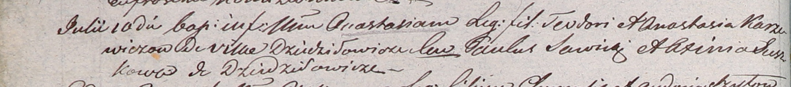

**Каржевич Анастасия Тодорова (Karzewiczowna Anastasia)**

10 июля 1804 г -- крещение (НИАБ 937-4-32, лист 10об, №18/1804-р).

**НИАБ 937-4-32:** Лист 10об. **Метрическая запись №18/1804-р.**

Дедиловичский костел Наисвятейшего Сердца Иисуса. 10 июля 1804 года.
Метрическая запись о крещении.

Karzewiczowna Anastasia -- дочь родителей с деревни Дедиловичи.

Karzewicz Teodor -- отец.

Karzewiczowa Anastasia -- мать.

Sawicki Paul -- крестный отец.

Suszkowa Axinia -- крестная мать, с деревни Дедиловичи.

Galinowski Joann -- ксёндз, комендант Дедиловичского костела.
