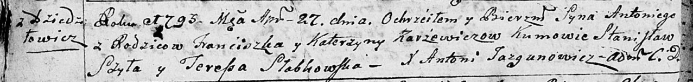

**Каржевич Антон Францишков (Karżewicz Antoni)**

27 апреля 1793 г -- крещение (НИАБ 136-13-894, лист 19об, №37/1793-р
(ориг)), (РГИА 823-2-18, лист 247, №17/1793-р (коп)).

**НИАБ 136-13-894:** Лист 19-об. **Метрическая запись №37/1793-р
(ориг).**

Дедиловичская Покровская церковь. 27 апреля 1793 года. Метрическая
запись о крещении.

Karżewicz Antoni -- сын родителей с деревни Дедиловичи.

Karżewicz Franćiszek -- отец.

Karżewicz Katerzyna -- мать.

Szyło Stanislaw - кум.

Słabkowska Teresa - кума.

Jazgunowicz Antoni -- ксёндз.

**РГИА 823-2-18:** Лист 247. **Метрическая запись №17/1793-р (коп).**

Дедиловичская Покровская церковь. 27 апреля 1793 года. Метрическая
запись о крещении.

Karżewicz Antoni -- сын родителей с деревни Дедиловичи.

Karżewicz Franciszek -- отец.

Karżewiczowa Katarzyna -- мать.

Szyło Stanisław -- кум.

Słabowska Teresa -- кума.

Jazgunowicz Antoni -- ксёндз.
