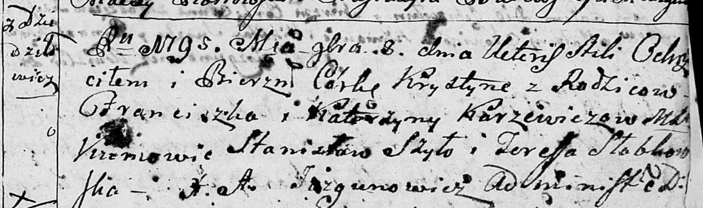

**Каржевич Хрыстына Францишкова (Karżewiczowna Krystyna)**

8 ноября 1795 г -- крещение (НИАБ 136-13-894, лист 26, №51/1795-р
(ориг)).

Лист 26. **Метрическая запись №51/1795-р (ориг).**

{width="6.496527777777778in"
height="1.9256922572178479in"}

Дедиловичская Покровская церковь. 8 ноября 1795 года. Метрическая запись
о крещении.

Karżewiczowna Krystyna -- дочь родителей с деревни Дедиловичи.

Karżewicz Franciszek -- отец.

Karżewiczowa Katerzyna -- мать.

Szyło Stanisław - кум.

Słabkowska Teresa - кума.

Jazgunowicz Antoni -- ксёндз.
