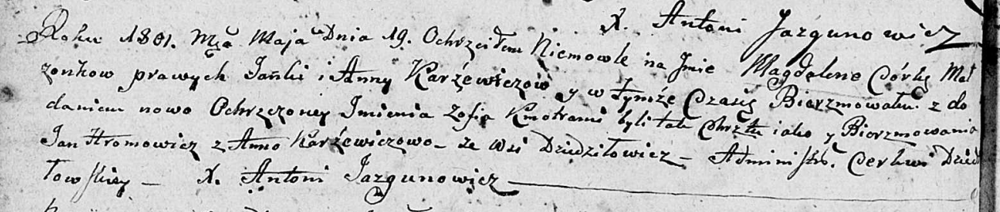

**Каржевич Магдалена Янкова (Karżewiczowna Magdalena Zofia)**

19 мая 1801 г -- крещение (НИАБ 136-13-894, лист 43об, №13/1801-р
(ориг)).

**НИАБ 136-13-894:** Лист 43об. **Метрическая запись №13/1801-р
(ориг).**

{width="6.496527777777778in"
height="1.3805708661417322in"}

Дедиловичская Покровская церковь. 19 мая 1801 года. Метрическая запись о
крещении.

Karżewiczowna Magdalena Zofia -- дочь родителей с деревни Дедиловичи.

Karżewicz Janka -- отец.

Karżewiczowa Anna -- мать.

Hromowicz Jan -- кум.

Karżewiczowa Anna -- кума.

Jazgunowicz Antoni -- ксёндз.
